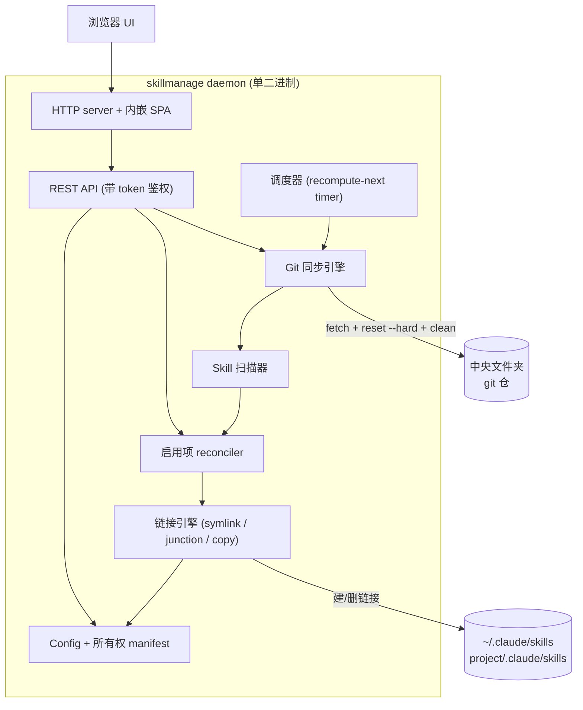
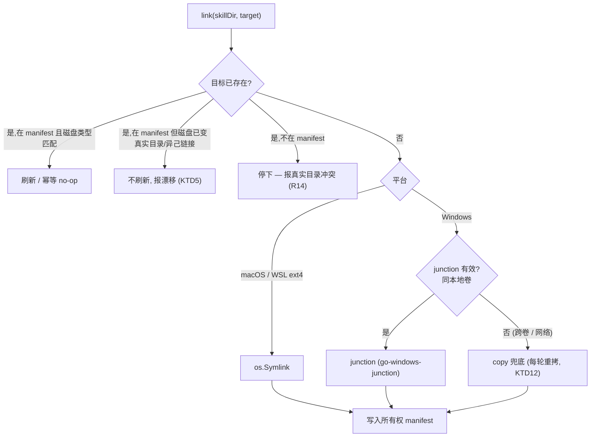
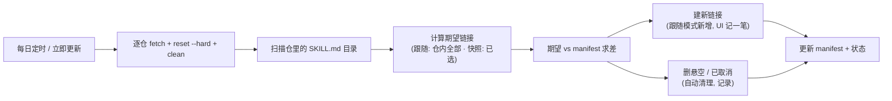

# feat: SkillManage — 跨平台 skill 仓管理 daemon

## 概述

SkillManage 是一个 Go 单二进制 daemon：在中央文件夹里跟踪多个 git skill 仓，每天定时保持最新，并把选中的 skill 链接进 Claude Code 的 skill 目录——由一个内置浏览器 UI 驱动。核心机制是**软链（macOS/WSL）或目录联接 junction（Windows）指向一个活的 git 镜像**，所以每天的 `git fetch` + `reset --hard` 让被链接的 skill 立刻最新，没有任何"更新"动作。一期只做 Claude Code。

---

## 问题背景

多个团队（后端、前端……）各自维护一个持续更新的 git skill 仓。今天成员逐个手动安装 skill，装完基本不再更新，于是本地副本陈旧、而仓在前进。skill 本质就是含 `SKILL.md` 的目录——根本不存在"安装"——但缺少一个统一入口来跟踪多仓、保持最新、并按需把单个 skill 暴露给 agent。

SkillManage 用「中央镜像 + 链接」模型取代逐个手动安装。优雅之处：因为链接指向活的 git 工作区，每天 `fetch + reset --hard` 让每个被链接的 skill 自动最新，无需复制、对比或版本步骤（见 origin: docs/requirements.md）。

---

## 需求

### 仓跟踪与更新

- R1. 用户可通过 UI 增删 git 仓 URL（可选分支）；仓被克隆进中央文件夹。
- R2. 仓清单可导出为文件、在另一台机器导入；每个人也可单独添加仓。
- R3. 被跟踪的仓每天定时自动更新。
- R4. UI 提供"立即更新全部"动作，触发即时同步。
- R5. 每个仓按严格只读镜像处理：同步是 `git fetch` + `git reset --hard origin/<branch>`，覆盖任何本地改动。
- R6. 私有仓认证复用系统 git 凭证（SSH agent / credential helper）；工具不存储凭证。
- R7. 单个仓同步失败（网络、认证、仓不存在）在 UI 标明原因，且不阻塞其他仓。

### skill 选择与链接

- R8. 工具扫描每个仓，把每个含 `SKILL.md` 的目录当作一个 skill 单元。
- R9. 选中整个仓（"全选"）是**跟随模式**：上游新增的 skill 在下次同步时自动建链。
- R10. 单独选择 skill（"单选"）是**快照模式**：只链接明确选中的，上游新增不自动纳入。
- R11. 一个 skill 可链到全局目标（`~/.claude/skills/`）和/或项目级目标（`<project>/.claude/skills/`）。
- R12. 用作链接目标的项目路径在 UI 里手动登记。
- R13. 两个仓暴露同名 skill、会占用同一链接名时，冲突被surf出来，用户先指定别名再建链。
- R14. 工具绝不覆盖目标处的真实目录（非本工具创建的）；遇到就停下并报告冲突。
- R15. 上游 skill 被删除或改名时，产生的悬空链接自动清理并记录。

### 平台、分发与生命周期

- R16. 工具以单个 Go 二进制分发，Web UI 内嵌；除系统 `git` 外无运行时依赖。
- R17. 链接在 macOS、WSL（软链）和 Windows（目录 junction，junction 无效处用 copy 兜底）下都可用，藏在一个抽象后面。
- R18. 一个长驻 daemon 在进程内跑调度器和 HTTP server；调度逻辑跨平台统一。
- R19. 安装/首次运行时，daemon 把自己注册到 OS 开机自启（launchd / Windows HKCU Run / WSL profile 钩子）。
- R20. 管理 UI 是单页浏览器应用：左侧仓列表带状态，右侧按仓选择 skill 带目标和链接状态。
- R21. HTTP server 绑定固定默认端口，被占则顺延到空闲端口，并报告实际地址。
- R22. 中央文件夹位置首次运行时选择，默认 `~/.skillmanage`。

### 安全与防误伤

- R23. HTTP server 只绑回环（`127.0.0.1`），每次 API 调用都需要本地存储的 bearer token；并校验 `Host` 头（只接受 `localhost`/`127.0.0.1:<port>`）以阻断浏览器页面的 DNS-rebinding 攻击。
- R24. git 仓 URL（UI 添加或从清单文件导入）按白名单校验 scheme（`https://`、`git://`、`ssh://` / `git@host:path`）；`file://`、`ext::`、含 shell 元字符的 URL 在克隆前被拒。
- R25. daemon 同步时绝不执行仓自带的 git hook，也不读系统/全局 git config（hook 禁用、系统 config 忽略）。
- R26. 在原地编辑被链接的 skill 被视为临时的：工具要么把链接呈现为只读，要么在 `reset --hard` 丢弃本地改动前告警——这样通过 `~/.claude/skills` 编辑的用户/agent 不会被静默销毁工作。

---

## 关键技术决策（KTD）

- KTD1. **软链指向活的 git 镜像，而非复制。** 链接指向仓工作区，`reset --hard` 即自动刷新被链接的 skill。已验证可行：团队一份 solution 文档记录了软链式 skill 发现的实测可用（Superpowers 模式）。这在 CC 官方文档里没写——由 U1 在任何东西建立其上之前先去风险。
- KTD2. **一个链接抽象，按平台分叉后端。** 单一 `Link()` 入口 + build-tag 拆分实现：`linker_unix.go` 用 `os.Symlink`；`linker_windows.go` 用 `nyaosorg/go-windows-junction`（原生 `DeviceIoControl` reparse）建目录 junction。（该库在编译为非 Windows 时本身会退回 `os.Symlink`，所以调用点保持单一——但计划层面的分叉是按 build tag，不是靠库的运行时分支。）Windows 上不用 `os.Symlink` 当主路径，因为它需要开发者模式/管理员；junction 免权限且只对目录。copy 兜底仅用于 junction 无效处（跨卷/网络目标）——其刷新语义见 KTD12。
- KTD3. **链接名 = 源 skill 目录名，而非 frontmatter 的 `name:`。** 源目录名本就是文件系统合法的；frontmatter 名可能含冒号（`ce:plan`）在 Windows 非法。仍保留一个 `sanitizePathName` 边界函数防御性地处理 Windows 全部保留字符（`\ / : * ? " < > |`、结尾点/空格、保留设备名）。（先验经验：colon-namespaced-names-break-windows-paths。）
- KTD4. **skill 作为 skill 根的直接子项被链接。** 每个被链接的 skill 是 `<skills-root>/<name>` → 仓 `<...>/<skill-dir>`。嵌套或打包布局无法被各 host 可移植地发现（先验经验：native-plugin-install-strategy）。这符合 CC 的 `<root>/<name>/SKILL.md` 预期。
- KTD5. **所有权清单（manifest）是强制的，但任何破坏性操作前都先和文件系统对账。** daemon 记录它创建的每个链接。清理、冲突检测（R14）、悬空清理（R15）都以 manifest 为准——但 manifest 可能和磁盘漂移（损坏、删了 `~/.skillmanage`、换机迁移）。所以：(a) 把一条 manifest 项当作"已拥有"前，先验证磁盘路径仍是预期类型的链接、且指向预期源——目标已变成真实目录或异己链接的 manifest 项**不刷新**；(b) 磁盘上存在但 manifest 没有的目标 = "真实目录" → 停下报告（绝不覆盖）；(c) manifest 是**机器本地的，R2 导出/导入不携带它**——只有仓清单随行；迁移后的机器靠自己的 `enabled[]` 重新建链来重建 manifest。
- KTD6. **只读镜像 = `fetch` + `reset --hard` + `clean -fd`，并禁用 hook 与系统 config。** 同步是 `git fetch --prune origin` → `git reset --hard origin/<branch>` → `git clean -fd`（光 reset 会留下未跟踪文件，上游删掉的 skill 目录可能残留并被当成活 skill 误扫）。daemon git 跑时带 `GIT_TERMINAL_PROMPT=0`、`GIT_SSH_COMMAND=ssh -o BatchMode=yes`、`GCM_INTERACTIVE=never`（无 TTY 时快速失败而非挂死），外加 `GIT_CONFIG_NOSYSTEM=1` 和把 `core.hooksPath` 指向空目录，使被攻陷的上游无法在 daemon 机器上跑 `post-checkout`/`post-merge` 等 hook（R25）。逐仓捕获 stderr 供 R7。因为被链接路径**就是**工作区，`reset --hard` 会丢弃原地编辑——用户编辑契约见 R26。
- KTD7. **标准库 recompute-next-timer 调度器，不用 24h ticker 也不用 cron 库。** 每轮计算下一个墙钟触发时刻、用 `time.Timer` 睡到点，自校正漂移/夏令时。启动时做一次"今天的运行错过了吗？"检查覆盖笔记本休眠造成的空档。单个每日任务不引入外部 cron 依赖。
- KTD8. **单实例守卫用中央文件夹里的 lockfile；端口绑定只为 UI 访问。** 因为有空闲端口顺延（R21），两个进程可能各绑不同端口同时跑——所以端口绑定不能当实例守卫（那会让第二个 daemon 与 manifest 和 git 工作区赛跑）。主守卫是 `~/.skillmanage` 里的 `gofrs/flock` lockfile（总在原生 FS），在任何同步/reconcile 前获取。启动时把解析出的 UI 绑定地址写到 `~/.skillmanage/address`，这样开机自启（无终端）拉起的 daemon 其 URL 仍可被发现。
- KTD9. **链接只放在原生文件系统。** WSL 下链接留在 ext4 内；`/mnt/c`（DrvFs）软链不可靠。若需要从 WSL 链到 Windows 盘，一期不做。
- KTD10. **悬空/junction 检测对 Go 1.23 敏感。** Windows junction 在 `winsymlink=1` 默认下不再报告 `ModeSymlink`；检测除 `ModeSymlink` 外还要查 `os.ModeIrregular`（及 reparse tag），用 `os.Lstat`/`os.Readlink` 不跟随。注意 `go-windows-junction` 只暴露 `Create()`——junction 的*删除*用 `os.RemoveAll`，*目标读取/类型识别*靠 reparse-tag 检查（`Microsoft/go-winio`，已是传递依赖）手写，因为 `os.Readlink` 不像解析软链那样解析 junction。
- KTD11. **本地 API 需要 bearer token + Host 头校验（R23）。** API 会改 `~/.claude/skills` 并跑 git，所以无认证的回环 server 会被同用户的任意进程或 DNS-rebinding 浏览器页面利用。token 在首次运行时生成、存配置目录（0600）、serve 时注入 SPA、每次 API 调用都要求；并校验 `Host` 头阻断 rebinding。
- KTD12. **copy 兜底目标每次 reconcile 都重新复制，并在 manifest 里标记。** copy 是静态快照——它不像链接那样自动刷新，所以不重新复制就会悄悄把工具本要消灭的陈旧问题带回来。manifest 记录 `link_type`（symlink/junction/copy）；reconcile 把 `copy` 目标每轮当作脏的、同步后重新复制；UI 区分"活链接"和"已复制（同步时刷新）"，让新鲜度契约诚实。

---

## 高层技术设计

### 组件架构



### 跨平台链接决策



### 同步-再-reconcile 周期



---

## 输出结构

```text
skillmanage/
├── go.mod
├── main.go                     # 入口：flag、首次运行、启动 daemon
├── internal/
│   ├── config/                 # config.yaml 读写，两块 + manifest
│   ├── pathutil/               # sanitizePathName（scanner 与 linker 共用）
│   ├── gitsync/                # 克隆、fetch+reset+clean、URL 校验、daemon 安全 env、状态
│   ├── scanner/                # SKILL.md 发现、skill 单元模型
│   ├── linker/                 # 跨平台链接抽象 + manifest 操作
│   │   ├── linker.go
│   │   ├── linker_unix.go      # os.Symlink
│   │   └── linker_windows.go   # junction + copy 兜底
│   ├── reconcile/              # 跟随/快照 → 期望链接 → 应用
│   ├── scheduler/              # recompute-next timer + 错过补跑
│   ├── autostart/              # launchd / registry / wsl profile
│   └── server/                 # http server、REST API、token 鉴权、embed UI
├── web/
│   └── dist/                   # 手写静态资源（无构建链），//go:embed all:dist 目标
└── docs/
    ├── requirements.md
    └── plans/

# 运行时在 ~/.skillmanage/ 下：config.yaml、manifest、lockfile、address 文件
```

---

## 实施单元

按阶段分组。每个单元可独立落地、按依赖排序。

### 阶段 A — 去风险与地基

### U1. 软链/junction 跟随性验证 spike

- **目标：** 实测确认 Claude Code 能发现并加载一个其 `~/.claude/skills/` 下目录是**软链（macOS、WSL）以及 Windows 目录 junction** 的 skill，在任何代码依赖它之前。junction 路径是最分叉、最高风险的机制，必须进入这道闸门——不能推到打包阶段。
- **需求：** R1 使能；KTD1 + KTD2 去风险。
- **依赖：** 无。
- **文件：** `docs/solutions/symlink-skill-discovery-<date>.md`（记录结果 + 验证时的 CC 版本）。
- **做法：** 手动在别处建一个真实 skill 目录，链进 `~/.claude/skills/<name>`（macOS/WSL 用软链；Windows 用 `mklink /J` 建 junction），开 CC 会话，确认 skill 出现且能跑。对项目级 `.claude/skills/` 重复。测悬空情形（删源）观察 CC 行为。记录验证矩阵**及确切 CC 版本**——这是无兼容契约的未文档化行为。若某平台链接失败，该平台退回 copy 同步（KTD12）并在继续前记录设计影响。
- **执行提示：** 这是 spike——产出是记录的结论，不是生产代码。其余构建以正向结果为闸门。Windows junction 验证可在 Windows 机/VM 上做；若 U1 时拿不到，就明确把一期 Windows 链接收窄为 copy 兜底直到 junction spike 通过，而不是未验证就建 junction 路径。
- **测试预期：** 无——手动验证 spike；结论写进 solution 文档。
- **验证：** 软链 skill（macOS/WSL）和 junction skill（Windows）各自在真实 CC 会话中确认可加载；验证的 CC 版本与平台注意点写下来。

### U2. 项目脚手架与配置模型

- **目标：** 搭起 Go module、目录布局、带内嵌 UI 占位的构建，以及 config + 所有权 manifest schema 的读写。
- **需求：** R16, R22。
- **依赖：** 无。（U1 的结论必须在选定*链接器*路径前记录，但脚手架与配置模型不依赖链接是否可用——U1 闸门在 U5 而非这里，所以 U2 可与 U1 并行落地。）
- **文件：** `go.mod`、`main.go`、`internal/config/config.go`、`internal/config/config_test.go`、`web/dist/index.html`（占位）、`internal/server/embed.go`（`//go:embed all:dist`）。
- **做法：** 定义 `config.yaml`：`repos[]`、`enabled[]`（skill + target + mode）、`projects[]`、`schedule`；外加独立的所有权 manifest 结构（链接名 → 目标 → 源 → `link_type`，含 KTD12 的 symlink/junction/copy）。首次运行流程解析/创建中央文件夹（默认 `~/.skillmanage`）。用 `//go:embed all:dist`（`all:` 前缀必须，否则哈希/下划线资源目录会被静默丢弃）。
- **遵循模式：** 标准 `internal/` 包布局；`embed.FS` + `fs.Sub`。
- **测试场景：**
  - 往返：写一个含跟随/快照混合项的 config，重载，断言相等。
  - 缺 config 文件 → 产出首次运行默认值（中央文件夹 = `~/.skillmanage`）。
  - 畸形 YAML → 加载返回清晰错误，不 panic。
  - 含一条源已不存在的 manifest 项可表达且往返保持。
- **验证：** `go build` 产出能 serve 占位页的二进制；config 与 manifest 跨重启保持。

### 阶段 B — 核心引擎

### U3. Git 同步引擎

- **目标：** 克隆被跟踪的仓并以只读镜像同步，用 daemon 安全、非交互、禁 hook 的 git，校验 URL，逐仓捕获状态与失败原因。
- **需求：** R3（机制）、R5、R6、R7、R24、R25。
- **依赖：** U2。
- **文件：** `internal/gitsync/gitsync.go`、`internal/gitsync/gitsync_test.go`、`internal/gitsync/urlcheck.go`、`internal/gitsync/urlcheck_test.go`。
- **做法：** 克隆前先按白名单校验每个仓 URL 的 scheme（`https`/`git`/`ssh`/`git@host:path`），拒绝 `file://`、`ext::` 与含 shell 元字符的 URL（R24）——UI 添加和导入共用此校验。经 `exec.CommandContext` shell out（设 `cmd.Dir`，绝不 `cd`）。不存在则克隆；否则 `git fetch --prune origin` → `git reset --hard origin/<branch>` → `git clean -fd`。env：`GIT_TERMINAL_PROMPT=0`、`GIT_SSH_COMMAND=ssh -o BatchMode=yes`、`GCM_INTERACTIVE=never`、`GIT_CONFIG_NOSYSTEM=1`，并把 `core.hooksPath` 指向空目录（R25）；其余继承环境以使用系统 credential helper / SSH agent（R6）。`reset --hard` 前先 `git status --porcelain`；若工作区脏，按 R26 surf出来而不是静默丢弃。逐仓捕获 stderr；`exec.LookPath` 解析 `git`。
- **遵循模式：** 把 git 当状态机——把预期内的非零退出与真失败区分开（先验经验：git-workflow-state-machines）。
- **测试场景：**
  - URL 校验：接受 `https://`/`git@host:path`；克隆前拒 `file:///etc/passwd`、`ext::sh -c …`、含元字符 URL。
  - 本地 fixture 仓首次克隆成功；二次运行干净 no-op。
  - 上游删了某跟踪文件/目录 → `reset --hard` + `clean -fd` 后镜像与 HEAD 完全一致（无残留未跟踪目录被误读为活 skill）。
  - 仓带 `post-checkout` hook → 同步时 hook 不执行（hooksPath 已禁用）。
  - 工作区脏（原地编辑）→ 按 R26 surf出来、不静默清掉，再决定是否 reset。
  - 缺 `git` 二进制 → 可操作的错误，不 panic。
  - 模拟认证失败（不可达 remote）→ 返回带捕获 stderr 的错误；单仓失败不中止整批。
  - context 取消能杀掉挂死的 fetch。
- **验证：** 仓收敛到上游 HEAD；非法 URL 与仓 hook 被挡；失败逐仓报告原因且互不影响。

### U4. Skill 扫描器

- **目标：** 遍历每个仓，枚举 skill 单元（含 `SKILL.md` 的目录），产出文件系统安全的链接名。
- **需求：** R8。
- **依赖：** U2。
- **文件：** `internal/scanner/scanner.go`、`internal/scanner/scanner_test.go`、`internal/pathutil/sanitize.go`、`internal/pathutil/sanitize_test.go`。
- **做法：** 遍历仓树；每个含 `SKILL.md` 的目录是一个 skill 单元、以其目录名标识。`sanitizePathName`（KTD3）放在独立的 `internal/pathutil` 包（单一归属，scanner 与 linker 都 import，使去重 key 计算一致——绝不逐单元各写一份），用它派生链接名、并单独保留逻辑名。已找到的 skill 之下的嵌套 skill 跳过（直接子项约束 KTD4）。
- **测试场景：**
  - 含多个顶层 skill 目录的仓 → 全部找到、名字正确。
  - skill 目录名含冒号 → 链接名被 sanitize；逻辑名保留。
  - 无 `SKILL.md` 的目录 → 不算 skill。
  - 空仓 → 空结果、无错误。
- **验证：** 扫描器输出与已知 fixture skill 集匹配，名字已 sanitize。

### U5. 链接引擎

- **目标：** 跨平台、幂等地建/删链接，所有权 manifest 跟踪并与文件系统对账，真实目录保护，同根与跨目标冲突检测，Go-1.23 敏感的悬空/junction 检测。
- **需求：** R11、R13、R14、R15、R17。
- **依赖：** U2、U4。**以 U1 为闸门**——按平台选定的链接器后端取决于 U1 的软链/junction 结果（U1 闸门在这里，不在 U2）。
- **文件：** `internal/linker/linker.go`、`internal/linker/linker_unix.go`、`internal/linker/linker_windows.go`、`internal/linker/linker_test.go`。
- **做法：** 单一 `Link(skillDir, target)` 入口。Unix → `os.Symlink`；Windows → `nyaosorg/go-windows-junction`（只提供 `Create()`——删除用 `os.RemoveAll`，目标读取/类型识别靠 `Microsoft/go-winio` 的 reparse-tag 检查，KTD10）。跨卷检测（如比较源/目标的 `GetVolumePathNameW`）决定是否走 copy 兜底（KTD12）。幂等并与 FS 对账（KTD5）：manifest 拥有项只有当磁盘路径仍是预期类型、指向预期源时才刷新/no-op；非拥有的真实目录 → 停下报告（R14）；有 skillmanage 签名但 manifest 无记录的链接是可收编的、不当孤儿。冲突检测覆盖两种：同根撞名（两仓 → 同根同链接名 → surf出来让用户起别名，R13），**以及**跨目标遮蔽（同一 sanitize 后的名既链全局又链项目 → CC 会遮蔽项目那个 → surf 出遮蔽告警，全局胜出）。悬空检测用 `os.Lstat`/`os.Readlink`，查 `ModeSymlink` **和** `ModeIrregular`（KTD10），自动移除并记录（R15）。
- **遵循模式：** 单一抽象、build-tag 拆分实现；幂等的变更边界（先验经验：agent-friendly-cli 幂等性）。
- **测试场景：**
  - 建链接 → 存在且解析到源；重跑是 no-op（幂等）。
  - 目标被非 manifest 真实目录占用 → 返回冲突错误，目录原封不动。
  - manifest 说已拥有，但磁盘目标现在是真实目录/异己链接 → 不刷新；作为漂移 surf出来（不静默覆盖）。
  - 有 skillmanage 签名但 manifest 无记录的链接 → 被收编/可清理，不永久孤立。
  - 两个 skill 在同根解析到同名 → 撞名 surf出来，两者都不静默覆盖。
  - 同名既链全局又链项目 → surf 出跨目标遮蔽告警。
  - 源被删 → 链接被检为悬空并自动移除；manifest 更新并记录变更。
  - 删链接 → 磁盘与 manifest 都消失。
  - （Windows，可达时）免提权建 junction；junction 删除与 reparse-tag 目标读取被覆盖；`ModeIrregular` 悬空检测路径被覆盖。
- **验证：** 链接在本机平台正确建/删；破坏性操作前 manifest 与磁盘对账；真实目录绝不被覆盖；跨目标遮蔽被检出。

### U6. 启用项 reconciler

- **目标：** 把 `enabled[]` 配置翻译成期望链接集并应用差异，尊重跟随 vs 快照语义与逐项目标；copy 目标每轮重拷；跟随模式新增对外可见。
- **需求：** R9、R10、R11、R15。
- **依赖：** U4、U5。
- **文件：** `internal/reconcile/reconcile.go`、`internal/reconcile/reconcile_test.go`。
- **做法：** 对每条启用项计算期望链接：跟随模式（`repo/*`）展开为仓内当前全部 skill 单元（上游新增自动出现），快照模式是固定选中集。期望 vs 所有权 manifest 求差 → 建新增、删已取消与悬空。copy 类型目标（KTD12）每轮视为脏、同步后重拷。目标解析到全局或已登记项目路径。本轮"新增/变更/移除"汇总暴露给状态接口，供 UI 在跟随模式下展示（R9 不再"完全静默"，而是自动建链 + UI 记一笔）。
- **测试场景：**
  - 跟随模式仓上游新增 skill → reconcile 自动建链且汇总进本轮变更（无需用户操作，但 UI 可见）。
  - 快照项 → 上游新增不被链接。
  - 取消先前启用的 skill → 其链接被移除。
  - 同一 skill 既启用到全局又到项目 → 建两个链接（并触发 U5 跨目标遮蔽告警）。
  - 跟随模式下上游移除 → 悬空链接清理（委托 U5）并记录。
  - copy 类型目标 → 每轮 reconcile 重拷以保持新鲜。
- **验证：** reconcile 后磁盘链接恰好等于配置派生的期望集；跟随/快照语义可观察地不同；copy 目标随同步刷新。

### 阶段 C — 调度、server、生命周期

### U7. 调度器

- **目标：** 在 recompute-next timer 上跑每日「同步-再-reconcile」周期，带醒来后补跑检查和手动触发入口。
- **需求：** R3、R4。
- **依赖：** U3、U6。
- **文件：** `internal/scheduler/scheduler.go`、`internal/scheduler/scheduler_test.go`。
- **做法：** 每轮从 `schedule.daily_at` 算下一墙钟触发时刻、用 `time.Timer` 睡到点；每轮重算以自校正漂移/夏令时（KTD7）。启动时若上次成功运行早于今天的计划时刻，立即跑一次（覆盖休眠空档）。暴露 `RunNow()` 供 R4。可 context 取消以便关停。
- **测试场景：**
  - 下次触发计算：注入一个早于/晚于今天 `daily_at` 的时钟，算出的下次时刻正确。
  - 补跑检测：上次运行时间戳早于今天窗口 → 启动时触发立即运行。
  - `RunNow()` 带外触发一轮，不扰乱每日计划。
  - context 取消能及时停循环。
- **验证：** 在快进时钟测试里每日周期按配置时刻触发；手动触发与补跑路径都能跑一轮。

### U8. HTTP server 与 REST API

- **目标：** serve 内嵌 SPA 并暴露 UI 驱动的 REST API，带 token 鉴权 + Host 校验、固定端口再顺延空闲端口、地址落盘。
- **需求：** R1、R2、R4、R7、R12、R20、R21、R23、R24。
- **依赖：** U2、U3、U6、U7。
- **文件：** `internal/server/server.go`、`internal/server/api.go`、`internal/server/auth.go`、`internal/server/server_test.go`。（`//go:embed` 设置在 `internal/server/embed.go` 由 U2 建立；本单元消费它，不重复声明该文件。）
- **做法：** `http.FileServerFS(fs.Sub(distFS,"dist"))` 带 SPA index 回退处理客户端路由。首次运行生成 bearer token、存配置目录（0600）、serve 时注入 SPA；每个 API 请求校验 token 与 `Host` 头（R23/KTD11）。REST 端点：增删仓、导入/导出仓清单（导入复用 U3 的 URL 白名单校验，R24）、按仓列 skill、启用/停用 + 设 mode + target、登记项目路径、立即更新、读状态（逐仓同步态 + 失败 + 冲突 + 悬空事件 + 本轮变更汇总）。绑固定默认端口；`EADDRINUSE` 时绑 `:0`、保持监听器、把实际地址报告并写入 `~/.skillmanage/address`（KTD8）。
- **测试场景：**
  - 鉴权：无 token / 错 token 的请求被拒；正确 token 通过。
  - Host 头非 `localhost`/`127.0.0.1:<port>` 的请求被拒（rebinding 防护）。
  - SPA 回退：未知非资源路径返回 `index.html`；真实资源路径返回资源。
  - 添加仓端点持久化到 config 并触发克隆；非法 URL 被 U3 校验挡下。
  - 导出再导入往返仓清单。
  - 立即更新端点触发一轮同步并返回状态。
  - 默认端口被占 → server 绑备用端口、报告并写入 address 文件。
  - 状态端点反映注入的仓失败（R7）与链接冲突（R14）。
- **验证：** UI 驱动流程端到端跑通；无 token 请求被拒；第二个实例（lockfile，见 U9）无法启动。

### U9. OS 开机自启与单实例锁

- **目标：** 按平台最小权限注册开机自启，并以 lockfile 做主单实例守卫。
- **需求：** R18、R19。
- **依赖：** U8。
- **文件：** `internal/autostart/autostart.go`、`internal/autostart/autostart_darwin.go`、`internal/autostart/autostart_windows.go`、`internal/autostart/autostart_linux.go`、`internal/autostart/autostart_test.go`、`internal/lock/lock.go`。
- **做法：** macOS → 写 `~/Library/LaunchAgents/<id>.plist`（RunAtLoad），`launchctl bootstrap gui/$uid` 加载。Windows → `golang.org/x/sys/windows/registry` 写 `HKCU\...\CurrentVersion\Run`（免管理员）。WSL/Linux → 往 `~/.profile` 追加幂等的守卫式启动器，并注明有 user-systemd 时那是更干净的路径。提供 register/unregister + UI 开关（UI 开关需要 unregister 以"关闭自启即从磁盘移除注册项"）。主单实例守卫 = `gofrs/flock` 锁住 `~/.skillmanage` 内的 lockfile（KTD8），在任何同步/reconcile 前获取。
- **测试场景：**
  - register 后 unregister 无残留（可运行平台上）；register 幂等。
  - plist / 注册表值 / profile 钩子内容格式正确（字符串内容断言）。
  - 第二个实例获取 lock 失败；进程退出时释放。
- **验证：** 注册后 daemon 在本机平台登录时启动；关掉开关干净移除；第二个实例被 lockfile 挡住。

### 阶段 D — UI

### U10. 单页 Web UI

- **目标：** 构建管理 SPA：左侧仓列表带状态，右侧按仓选 skill（跟随/快照）、选目标、看链接状态；并把所有交互流程定义清楚，避免实现者各写各的。
- **需求：** R1、R2、R4、R9、R10、R11、R12、R13、R14、R15、R20、R26。
- **依赖：** U8。
- **文件：** `web/dist/` 下直接手写的静态资源（`index.html` + 少量 `*.js`/`*.css`）。**框架决策：极简——纯 HTML + 原生 JS，不引入打包构建链**，资源直接 embed，最契合"下一个文件即用"的单二进制分发。
- **做法（交互流程，需在实现前定清）：**
  - **首次运行流程：** API 返回 `not-configured` 态 → SPA 渲染独立设置页（不是双栏主界面），含默认 `~/.skillmanage` 的路径输入、确认按钮、文件夹用途简述；确认后切到主界面。daemon 在确认前重启 → 再次显示设置页。
  - **左侧仓列表状态机：** 每个仓行处于 [cloning / sync-in-progress / ok（带上次同步时间戳）/ failed（带捕获 stderr 摘要，可展开）/ never-synced] 之一。failed 行可展开看错误。
  - **添加仓（异步）：** 添加后立即以 `cloning…`（转圈）出现在左栏；成功转 `ok`，失败转 `failed(原因)` 带移除/重试。
  - **冲突解决（R13 别名）：** reconcile 检测到撞名 → 不建链 → 受影响 skill 行内联告警，显示两个源路径 + 预填建议别名的文本框；用户改别名并确认 → 别名持久化、建链；取消则该 skill 留在「未链接/冲突待决」态；别名仍被占则继续提示。
  - **真实目录冲突（R14）：** skill 行有独立的「被真实目录挡住」态，显示完整冲突路径、说明工具不会动它、提供「忽略」动作（可重新展开）；视觉上与 R13 别名冲突、R15 悬空事件区分开。
  - **悬空清理（R15）：** 每条被清理的链接在「最近变更」区出现一条可忽略的记录（skill 名、仓、时间戳）；自动清理无需用户动作，但至少保留一个会话可见，让用户注意到意外消失。
  - **跟随模式新增提示：** 同步后在仓行显示「本次新增 N 个 skill」并在右栏给新建链接的 skill 加「new」标记直到忽略（R9 不再完全无声）。
  - **跟随↔快照切换：** 跟随→快照时预勾当前已链接的全部 skill（冻结现状）并提示「已切快照——上游新 skill 不再自动链接」；快照→跟随时确认「这会自动链接本仓当前及未来全部 skill」。
  - **项目登记（R12）：** 独立「项目」区的表单（非 skill 行上的弹窗）；提交后立即出现在所有目标选择器；重复路径提示「已登记」；移除有活链接的项目时列出受影响 skill 并要求确认，受影响 skill 转错误态。
  - **导入仓清单：** 默认增量合并（按 URL 匹配已有则跳过、新增则加）；导入前显示摘要「新增 X、已存在 Y、跳过」并确认；明确导出格式（URL + 可选分支的纯列表）使解析无歧义。
  - 另含「立即更新全部」按钮（带进行中/完成态）、开机自启开关（读后端注册状态，失败显示内联错误并回退开关态）。
- **遵循模式：** 消费 U8 的 REST API；资源少且手写，缓存失效用文件名版本后缀或 `?v=` 查询串即可（embed 的 mtime 不可靠，故不依赖它）。无 node 工具链，无 bundler。
- **测试场景：** 主要手动/视觉；若搭了组件测试，覆盖跟随/快照切换态、冲突告警渲染、真实目录冲突态、首次运行设置页。API 集成行为标注为经 U8 测试覆盖。
- **验证：** 用户能在浏览器里完成：添加仓 → 看同步 → 两种模式选 skill → 选目标 → 解决一次别名冲突 → 看到一次悬空清理 → 触发立即更新。

### 阶段 E — 打包

### U11. 交叉编译与发布打包

- **目标：** 为 macOS 与 Windows 产出内嵌 UI 的单二进制。
- **需求：** R16。
- **依赖：** U10。
- **文件：** `Makefile` 或构建脚本、CI workflow（如有）。
- **做法：** 无前端构建步骤（`web/dist` 是手写静态资源）。直接按 `GOOS/GOARCH`（darwin/amd64、darwin/arm64、windows/amd64）`go build`。验证 `all:dist` 内嵌包含全部资源。WSL 用 linux 构建。
- **测试预期：** 无——构建/打包单元；正确性靠冒烟运行各产物验证。
- **验证：** 每个平台二进制能启动、serve 真实 UI、对测试仓跑一次同步。

---

## 风险与依赖

- **CC 跟随软链未被官方文档化。** 整个模型依赖它。由 U1（先做验证 spike）和团队实测先验缓解；某平台 spike 失败则该平台退 copy 同步（KTD12）。**更进一步：这是无兼容契约的行为，CC 任何更新都可能改变它。** U1 记录验证时的 CC 版本；建议运行时加一个 canary 自检（reconcile 后确认至少一个被链接的 skill 仍可被发现），并在检测到 CC 版本变化时提示重新验证——否则回归会表现为"skill 静默失效"而工具 UI 无信号。
- **原地编辑被销毁（R26）。** 被链接路径就是 git 工作区，通过 `~/.claude/skills` 编辑 skill（你自己的 skill-creator 流程就这么做）会在下次 `reset --hard` 被静默清掉。靠 R26 的只读契约/脏态告警缓解——这是必须实现的，不是可选。
- **manifest 是唯一安全仲裁者（KTD5）。** manifest 丢失/损坏/迁移会反转安全模型。靠 FS 对账、签名链接收编、明确 export 不携带 manifest 缓解。
- **跟随模式 + 静默自动链接 = 供应链面。** 能 push 任一被跟随仓的人可向所有跟随者的 agent 注入可执行的新 skill。靠「本轮新增/变更可见」（U6/U10）部分缓解；一期接受"始终最新"为产品取向，但把上游破坏会随每日同步全员传播这点记为有意识的权衡（如需稳定可在后续支持按 commit/tag pin）。
- **本地 API 是攻击面（R23/KTD11）。** 无认证回环 server 可被同用户进程或 DNS-rebinding 利用来注入 skill。靠 token + Host 校验缓解。
- **凭证继承的信任边界（R6）。** daemon 继承系统 git 凭证；与私有仓并列添加恶意/同前缀 host 仓可能诱导 credential helper 泄露凭证。一期记为已知信任边界，UI 提示"所有被跟踪仓都能用系统凭证"；后续可考虑按可信 host 隔离。
- **单实例竞态（KTD8）。** 端口绑定不能当实例守卫；改用 lockfile 为主，避免两个 daemon 竞争 manifest 与 git 工作区。
- **Windows junction 边角。** 跨卷/网络目标对 junction 无效 → copy 兜底（KTD2/KTD12）。Go 1.23 `winsymlink` 改了链接模式报告 → 悬空检测查 `ModeIrregular`（KTD10）。`go-windows-junction` 只提供 `Create()`，删除/读取需手写。这些只能在 Windows 测试机上验证，R17 完成前需 Windows 验证。
- **WSL `/mnt/c` 软链不可靠** → 链接限 ext4（KTD9）；从 WSL 链到 Windows 盘一期不做。
- **依赖：** 各机有系统 `git`；Go 1.22+；库 `nyaosorg/go-windows-junction`、`Microsoft/go-winio`、`golang.org/x/sys`（含 `windows/registry`）、`gofrs/flock`。

---

## 范围边界

### 一期范围内

Claude Code skill 管理端到端：多仓跟踪、每日 + 手动只读镜像同步、跟随/快照选择、全局 + 项目目标、带冲突/悬空安全的跨平台链接、内嵌浏览器 UI、带开机自启的 daemon、本地 API 鉴权与 git 安全加固。

### 推迟到以后

- **Codex 支持。** 需先验证 Codex 的 skill 格式与目标目录是否和 CC 一致，再加第二个 host 适配层（origin: docs/requirements.md §9）。先验证格式，再加 host-adapter。
- **从 WSL 链到 Windows 盘。** 受 DrvFs 可靠性阻塞（KTD9）。
- **按 commit/tag pin 仓、同步前内容 diff 审阅门。** 若一期"始终最新"取向需要补稳定性时再做。

### 推迟的后续工作

- 落地后把本项目的新地基沉淀为 `docs/solutions/` 条目：软链-vs-junction 抽象、开机自启的逐 OS 矩阵、WSL 文件系统边界行为（团队学习库里目前都没有）。

---

## 来源 / 研究

- origin: docs/requirements.md —— 已对齐的需求与决策记录。
- CC skill 发现：官方文档确认 `~/.claude/skills/` + 项目 `.claude/skills/`、`<name>/SKILL.md` 结构、会话内实时重扫、个人覆盖项目；**软链跟随未文档化**。
- 团队学习：`native-plugin-install-strategy`（软链发现可用；直接子项约束；遮蔽；强制清理陈旧产物），`colon-namespaced-names-break-windows-paths`（FS 边界 sanitize），`git-workflow-skills-need-explicit-state-machines`（git 当状态机），`agent-friendly-cli-principles`（幂等变更）。
- Go 跨平台：`embed` + `http.FileServerFS`（Go 1.22+，`all:` 前缀必须）；Windows 上 `os.Symlink` 需开发者模式 → `nyaosorg/go-windows-junction`（原生 reparse，仅 `Create()`，删除/读取需 go-winio）；Go 1.23 `winsymlink` → junction 检测用 `ModeIrregular`；recompute-next-timer 调度；launchd/HKCU-Run/WSL 自启；lockfile（gofrs/flock）单实例 + 端口仅供 UI；daemon git 非交互 env + 禁 hook + `clean -fd`。
