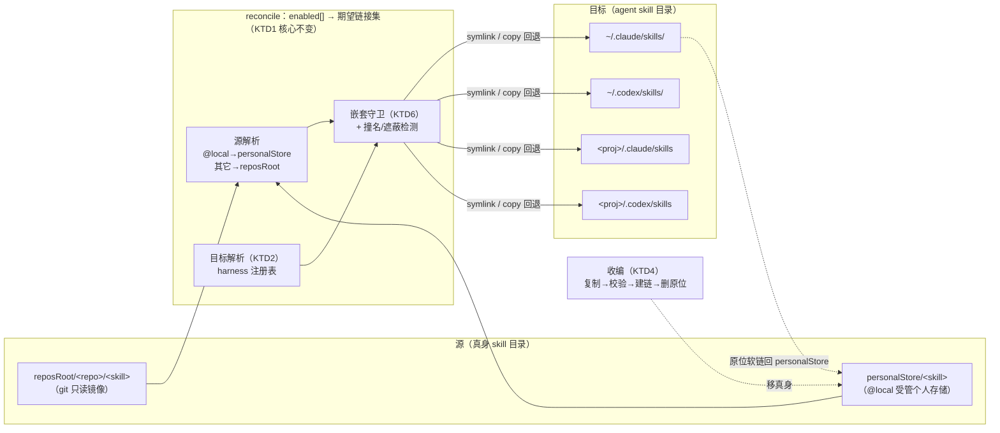
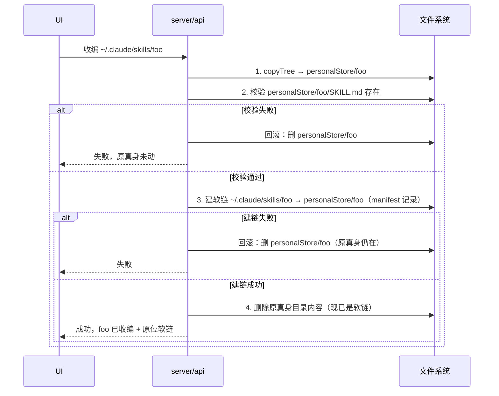

# feat: SkillManage 二期 — 跨 harness 统一映射层 + 本地 skill 收编

## 概要

一期把「中央 git skill 仓 → 软链进 Claude Code skill 目录」跑通了。二期在**不改变架构**的前提下，把它从「单 harness 链接器」升级为「**跨 harness 统一映射层**」：同一份 skill 源，可同时映射到 Claude Code 与 Codex 的个人/项目级 skill 目录；并新增一个「**收编本地 skill**」入口，把散落在 `~/.claude/skills/` 的真身 skill 移进受管个人存储、原位软链回去，从此纳入统一管理。

**方案标尺（不可破）**：skillmanage 是**纯映射层**——只建/删链接，**绝不修改 skill 内容**；叠加一期三条不变式：① git 仓是只读镜像（`reset --hard` + `clean -fd`）；② never-clobber 真实目录（manifest 与文件系统交叉校验后才动手）；③ manifest 是所有权唯一裁决者。

**关键复用**：一期的 `scanner`（扫 SKILL.md 目录）、`linker`（软链/junction/copy 三态 + 所有权）、`reconcile`（enabled[] → 期望链接集 diff）三大件可直接复用。Codex 经本机实测（codex 0.136）软链可用、SKILL.md 格式与 CC 完全一致，因此「支持 Codex」≈「多几个链接目标 + 一个嵌套守卫」。

---

## 问题框架

一期的局限：
- **只认 Claude Code**：链接目标写死 `~/.claude/skills/` 与项目 `.claude/skills/`。用 Codex 的人无法复用同一套中央 skill 仓。
- **只能"仓 → agent"单向**：用户本地已有的、手写或历史遗留的 skill，散落在 `~/.claude/skills/`，不在任何受管仓里，享受不到统一更新/同步/跨 harness 映射。

二期解决：
1. 让链接目标覆盖 Codex（个人级 `~/.codex/skills/` + 项目级 `.codex/skills`），并允许一个源 skill 一次性映射到多个 harness。
2. 提供「收编」入口，把本地真身 skill 移入受管个人存储，原位软链回去，使其与仓内 skill 一样可被统一映射。

**目标用户**：同时（或将来）使用 CC 与 Codex、希望一处管理、多处生效的开发者（即本工具作者本人画像）。

---

## 需求追溯

| ID | 需求 | 对应单元 |
|---|---|---|
| F2 | Codex 个人级链接目标 `~/.codex/skills/`（软链），排除守护区 `.system`、`vendor_imports` | U1 |
| F5 | 项目级 Codex 目标 `.codex/skills`（兼容探测 `.agents/skills`），与 CC 项目级并列 | U2 |
| F3 | 嵌套 SKILL.md 守卫：链接到 Codex 前检测源目录含嵌套 SKILL.md，告警（防 #22275 递归污染） | U3 |
| F4 | 跨-harness 选择：一个源 skill 可映射到 CC / Codex / 两者，状态合并展示 | U4 |
| F8 | 跨-harness 搜索：搜索/过滤覆盖两端已链接 skill | U4 |
| F1 | 收编本地 skill（仅个人文件夹目的地，仅采集 CC）：移入受管个人存储 + 原位软链回去 | U5（后端）、U6（前端） |
| F6 | 停用不删：临时关闭一个映射而不删源文件、不丢选择（靠链接增删实现，不写 agent 配置） | U7 |

**非目标（二期明确不做）**：F1 的「移动到 git 仓」目的地（破坏只读镜像，需单独立项）；F7 健康诊断面板；MCP server / slash command / marketplace / LLM 安全扫描 / 其它 harness（Cursor/Gemini）；改写 skill 内容或 agent 配置文件。

---

## 关键技术决策

### KTD1 · 多 harness = 多链接目标，reconcile 选择内核不变（但冲突检测需 harness 感知）
`config.EnabledEntry{Skill, Target, Mode}` 的 `Target` 字段本就是「目标目录」。映射到 Codex 即一条 `Target = ~/.codex/skills/` 的 enabled 条目。因此**不新增持久化 harness 字段**，`reconcile.computeDesired` 的核心选择逻辑（follow/snapshot 语义、源/目标匹配）不变；改动集中在「目标解析（哪些目录可选）」与 UI。Harness 身份由 Target 路径隐式承载。

> **修正（评审）**：`linker.DetectConflicts` 的遮蔽检测 `targetsByName` 仅按 `LinkName` 聚合，于是「同一 skill 同时映射到 CC 和 Codex」（F4 的核心 happy path）会产生 `len(tgts)>1` 的**假遮蔽冲突**。遮蔽语义（personal-over-project）是 **CC 内部**概念，跨 harness 不成立（Codex 两端都显示、不遮蔽）。**因此 DetectConflicts 必须 harness 感知**：仅当两个 Target 属于**同一 harness**（如 CC 个人 vs CC 项目）才算遮蔽；CC 与 Codex 同名不算。这要求把 harness 分类下沉到冲突检测，否则主用例每次都误报。
>
> **已考虑的备选**：在 `EnabledEntry`/`DesiredLink` 上加显式 `Harness` 字段，可让遮蔽检测、嵌套守卫、Codex 目标分类都 O(1) 判定，免去多处按路径前缀回推。结论：**不持久化到 config（保持向后兼容），但在内存 `DesiredLink` 上携带一个目标解析时计算出的 `Harness`/`Scope`**（来自 KTD2 注册表），供 DetectConflicts 与嵌套守卫直接读取，避免重复前缀匹配。

### KTD2 · 目标解析集中到一个 harness 注册表
新增一个**目标解析层**（`internal/harness`，纯函数），把"有哪些可链接目标"从散落在 UI/server 的硬编码集中成一处：给定「个人 + 已登记项目列表」，产出带元数据的目标列表 `{Harness, Scope, Dir, Guarded}`。CC 个人=`~/.claude/skills/`、Codex 个人=`~/.codex/skills/`；项目级按 harness 派生 `<proj>/.claude/skills`、`<proj>/.codex/skills`。守护目录（`~/.codex/skills/.system`、`~/.codex/vendor_imports/skills`）标记 `Guarded`，绝不作为链接目标、也不被扫描收编。

### KTD3 · 个人存储是「第二个源根」，与 reposRoot 同构
收编目的地 = 受管个人存储 `PersonalStorePath(centralDir)` = `<centralDir>/local/`（`personalStore`，随 centralDir 移动，**非硬编码 `~/.skillmanage/local`**——默认 centralDir 才是 `~/.skillmanage`）。它在概念上等同 `reposRoot`：一个存放 skill 真身目录的根。`reconcile` 从「单一 reposRoot」升级为「源解析器」：源选择器 `<ns>/<skill>` 中，普通 `<repo>` 命名空间解析到 `reposRoot/<repo>`，保留命名空间 **`@local`** 解析到 `personalStore`。具体编辑点：`computeDesired` 的 `getSkills` 闭包当前写死 `filepath.Join(r.reposRoot, repo)`，改为 `sourceRoot(repo)` 助手（`repo=="@local"` → personalStore，否则 reposRoot/repo），`scanCache` 键仍以 `repo` 字符串区分。`linker.looksOurs` 的所有权签名从「指向 reposRoot 之下」扩展为「指向 reposRoot **或** personalStore 之下」。

> **`@local` 保留前缀的硬化（评审修正）**：不能依赖「git 的 `RepoName` 永不以 `@` 开头」——已验证 `RepoName("https://x/@local.git")` = `"@local"`、`RepoName("git@host:o/@local.git")` = `"@local"`，该理由是**假的**。改为：① 加仓/导入时**拒绝任何 `RepoName` 以 `@` 开头的仓**（`ValidRepoName`/`RepoNameCollides` 显式把前导 `@` 视为保留前缀冲突），`@` 成为源命名空间的保留首字符；② `@local/<skill>` 中 `<skill>` 段必须再过一次 `ValidRepoName`（拒绝 `..`、分隔符），并校验 `filepath.Join(personalStore, skill)` 解析后仍在 personalStore 之下，杜绝 `@local/../../etc` 穿越。

### KTD4 · 收编 = 复制→强校验→建链→删原位（绝不先删），可回滚、可重入
移动必须数据安全：① 把源 skill 目录**复制**到 `personalStore/.tmp-<skill>`（临时名，复用 `linker.copyTree`，已跳过软链）；② **强校验复制完整**——不只是「SKILL.md 存在 + 目录非空」（评审指出：SKILL.md 通常最先复制，部分失败会留下「有 SKILL.md 但缺脚本」的残缺目录却通过弱校验，随后删原位 → **静默丢数据**）。改为**比对源与副本的相对路径文件集（数量 + 大小）一致**，再把 `.tmp-<skill>` 原子 `rename` 为 `personalStore/<skill>`；③ 在原位置建立指向 `personalStore/<skill>` 的软链（复用 `linker` 建链 + manifest 记录）；④ **最后**用 `os.Remove`（**非 `RemoveAll`**——此刻原位已是软链，`RemoveAll` 会跟随软链删掉 personalStore 真身）删除原位软链前的真身。任一步失败回滚已做步骤，原真身保持不动。

**中断点与重入（评审补充）**：
- 复制后崩溃 → 残留 `personalStore/.tmp-<skill>`：下次收编先清理同名临时目录。
- 建链后、删原位前崩溃 → 原位已是 manifest 记录的软链：`Adopt` 必须**幂等**——对「源已是我们 manifest 软链」的 skill 再次收编是 no-op（与 `ListAdoptable` 排除自有软链一致）。
- 源目录内若含软链（指向共享资产）：`copyTree` 跳过软链，副本会缺该文件。收编前若检出源含软链，告警（可能产生残缺副本）。

### KTD5 · 停用不删 = enabled 条目加 `Disabled` 标志，reconcile 跳过
F6 用一个 `EnabledEntry.Disabled bool`（yaml `disabled,omitempty`）实现：reconcile 计算期望集时跳过 `Disabled` 条目 → 其链接在下一次 reconcile 被作为「不再期望」移除（源文件、用户选择都保留）。重新启用即恢复链接。**不写** Codex `config.toml` 的 `enabled=false`（那会越出纯映射层、且改 agent 配置）。

### KTD6 · 嵌套 SKILL.md 守卫只告警、不阻断（Codex 目标）
`scanner` 增加探测：一个 skill 源目录内，除根 `SKILL.md` 外是否存在嵌套子目录 `SKILL.md`。当某条期望链接的 Target 属于 Codex 且其源含嵌套 SKILL.md 时，`reconcile` 产出一条 `Conflict{Kind: "nested"}` 告警（链接照建，因为这是用户数据，不替用户决定删/改）。CC 目标无此告警。

> **告警≠阻断污染（评审澄清）**：#22275 是 Codex 一侧的递归扫描行为——只要链接存在，污染就发生，告警只是知会，不能阻止。本计划**接受 nested+Codex 的污染为已知行为**，守卫的价值是让用户可见并自行决定（拆分源 / 仅映射到 CC）。验证项需**实测链接含嵌套源后 Codex 列表确实多出条目**，使污染可观测，而非假设已处置。

### KTD7 · 写入路径的安全防线（评审 P0/P0/P1）—— 防御在写侧，不只在列举侧
新增的收编与目标功能引入用户可控路径，必须在**实际写/删的路径**上校验，而非仅在「可选/可收编列表」上过滤（攻击者可绕过列表直接打 API）：

1. **`POST /api/adopt` 源路径包含校验**（P0 数据安全）：`ValidRepoName` 只校验单段名、不适用绝对路径。`Adopt` 及其 handler 必须先确认解析后的 `srcSkillDir` 前缀落在**白名单根**（`~/.claude/skills/` 或已登记项目 `.claude/skills/`）之下，否则拒绝——否则携带合法 token 者可 `{"src":"/etc"}`、`{"src":"~/.codex/skills/.system"}` 让 daemon 复制并删除任意目录。**优先方案**：API 不收裸 FS 路径，只收「`ListAdoptable` 结果中的 skill 标识」，服务端自行解析路径，从源头消除穿越面。
2. **守护区写侧重校验**（P0）：`.system`/`vendor_imports` 不只从列表隐藏；`Adopt` 与建链路径必须独立断言 `harness.Guarded(path)==false`，无论调用方如何拿到路径。
3. **`handleAddEnabled` 校验 Target 非守护区**（P1）：现有 handler 把任意 `Target` 直接落盘；二期把守护区列出后，须在写入前 `harness.Guarded(resolvedTarget)` 拒绝，否则 reconcile 下个周期会链进守护目录。
4. **新端点全部挂 `requireAuth`**：`/api/targets`、`/api/adoptable`、`/api/adopt` 与现有路由一致经 `requireAuth` + Host 守卫注册。

> KTD7 的守护判定复用 `internal/harness.Guarded`——这正是把它做成共享纯函数（KTD2）的理由：守护逻辑被「目标列举 / 收编扫描 / 收编写侧 / enabled 写侧」四处复用，内联反而漏掉写侧（#2/#3 即评审发现的真实缺口）。这一点也回应了「`internal/harness` 是否过早抽象」的质疑：**安全正确性要求守护判定单点复用，故保留为包是有据的**。

---

## 高层技术设计

映射层的源 → 目标关系（二期把"源"和"目标"都从单一扩成多元）：

收编（F1）数据流（KTD4，强调"绝不先删"）：

---

## 实现单元

### U1. Codex 个人级链接目标 + harness 目标注册表

**Goal**：让 `~/.codex/skills/` 成为合法链接目标，软链复用一期 linker；建立集中的目标解析层，并把守护目录排除在外。

**Requirements**：F2。

**Dependencies**：无（一期基础）。

**Files**：
- 新增 `internal/harness/harness.go`：`Target{Harness, Scope, Dir, Guarded, Ambiguous}` 类型 + `PersonalTargets()`（返回 CC/Codex 个人级目标）+ `Guarded(dir)` 判定 + `IsCodexTarget(dir)` 判定（供 U3 reconcile 用）。守护区为**两个独立目录树**：`~/.codex/skills/.system` 与 `~/.codex/vendor_imports/skills`，分别前缀匹配。
- 新增 `internal/harness/harness_test.go`。
- 修改 `internal/server/api.go`：新增 `GET /api/targets`（经 `requireAuth` 注册）；并在 `handleAddEnabled` 写入前校验 `harness.Guarded(resolvedTarget)==false`，否则 400（KTD7 #3）。
- 修改 `internal/server/dist/app.js`：`targetOptions()` 改为从 `/api/targets` 取，而非硬编码。

**Approach**：目标解析为纯函数，易测。Codex 个人目录用 `$CODEX_HOME` 优先、回退 `~/.codex`（与 codex CLI 一致）。守护目录判定用前缀匹配（清理后路径）。`reconcile.expandTarget` 已能解析 `~`，无需改链接内核——只是目标来源从硬编码变为注册表。所有新 `/api/*` 端点与现有路由一样经 `requireAuth` + Host 守卫注册（KTD7 #4）。

**Patterns to follow**：`internal/reconcile/reconcile.go` 的 `expandTarget`（`~` 展开）；一期 `app.js` 的 `targetOptions()`（被替换的对象）。

**Test scenarios**：
- `PersonalTargets()` 含 CC 个人 `~/.claude/skills/` 与 Codex 个人 `~/.codex/skills/`，各带正确 Harness/Scope 标签。
- `Guarded()`：`~/.codex/skills/.system`、`~/.codex/skills/.system/x`、`~/.codex/vendor_imports/skills` → true；`~/.codex/skills/`、`~/.codex/skills/my-skill` → false。
- `$CODEX_HOME` 设置时，Codex 目标根随之变化；未设置时回退 `~/.codex/skills/`。
- `GET /api/targets`（带 token）返回含 CC + Codex 个人目标的 JSON；缺 token → 401。
- `handleAddEnabled` 收到 `Target` 落在守护区（如 `~/.codex/skills/.system`）→ 400 拒绝，不落盘。

**Verification**：UI 链接目标下拉出现 Codex 个人目录；把一个 skill 链到 Codex 目标后，`codex debug prompt-input` 的 Available skills 列出该 skill（已实测机制可行）。

---

### U2. 项目级目标按 harness 派生（CC + Codex）

**Goal**：已登记项目同时派生 CC 项目级 `.claude/skills` 与 Codex 项目级 `.codex/skills` 目标；Codex 项目级兼容探测 `.agents/skills`。

**Requirements**：F5。

**Dependencies**：U1（目标注册表）。

**Files**：
- 修改 `internal/harness/harness.go`：新增 `ProjectTargets(projectPath)` → 派生该项目的 CC/Codex 项目级目标；Codex 项目级目录探测优先级 `.codex/skills` 存在则用之，否则 `.agents/skills`（官方文档路径），默认 `.codex/skills`。
- 修改 `internal/harness/harness_test.go`。
- 修改 `internal/server/api.go`：`GET /api/targets` 纳入项目级目标。

**Approach**：项目仍以 `config.Projects []string`（路径）登记，**不改 config schema**——一个项目自动展开为多个 harness 目标。歧义路径（`.codex/skills` vs `.agents/skills`）：两者都存在时选 `.codex/skills` 并置 `Target.Ambiguous=true`（供 UI 提示实选路径）。两者都不存在时默认 `.codex/skills`——该目录此刻可能不存在，但 `linker.createAndRecord` 已 `os.MkdirAll(d.Target)`，链接时按需创建，与一期行为一致（无需预先存在）。

**Patterns to follow**：一期 `app.js` 中 `targetOptions()` 对项目派生 `<proj>/.claude/skills` 的写法。

**Test scenarios**：
- `ProjectTargets("/p")` 返回 `/p/.claude/skills` 与 `/p/.codex/skills` 两个目标。
- 项目内已存在 `.agents/skills` 而无 `.codex/skills` → Codex 项目目标选 `.agents/skills`。
- 两者都不存在 → 默认 `.codex/skills`。
- 两者都存在 → 选 `.codex/skills`（仓实践优先），并在元数据标注存在歧义。

**Verification**：登记一个项目后，目标下拉同时出现该项目的 CC 与 Codex 两个项目级目标。

---

### U3. 嵌套 SKILL.md 守卫（Codex 目标）

**Goal**：检测源 skill 目录是否含嵌套 SKILL.md；当其被映射到 Codex 目标时，产出 `nested` 告警，防 #22275 递归注册污染 Codex skill 列表。

**Requirements**：F3。

**Dependencies**：U1（**reconcile 需 import `internal/harness` 做 Codex 目标分类**——确认依赖方向不成环：harness 是叶子纯函数包，不反向依赖 reconcile/server）。

**Files**：
- 修改 `internal/scanner/scanner.go`：`Skill` 增字段 `HasNested bool`（根 SKILL.md 之外，子目录内是否还有 SKILL.md）。
- 修改 `internal/scanner/scanner_test.go`。
- 修改 `internal/linker/linker.go`：`ConflictKind` 增 `ConflictNested = "nested"`。
- 修改 `internal/reconcile/reconcile.go`：在 `computeDesired` 内（`scanner.Skill` 仍在作用域时）即判定——对 `harness.IsCodexTarget(target)` 且 `sk.HasNested` 的期望链接，产出一条 `nested` Conflict。**不放进 `DetectConflicts`**，因为它是纯函数、只见 `DesiredLink{LinkName,Target,Source}`、拿不到 `HasNested`。
- 修改 `internal/reconcile/reconcile_test.go`。

**Approach**：嵌套判定需要两份信息——源的 `HasNested`（scan 时有）与「Target 属 Codex」（`harness.IsCodexTarget`）。两者都在 `computeDesired` 内可得，故在那里直接产 `nested` Conflict，汇入 `Summary.Conflicts`。UI 复用现有冲突展示通道（U4 定义文案/层级）。CC 目标完全不触发。

**Patterns to follow**：`linker.DetectConflicts` 产出 `Conflict` 的方式；`reconcile.Apply` 把 conflicts 汇入 `Summary` 的方式。

**Test scenarios**：
- 源 skill 仅根 SKILL.md → `HasNested=false`，无论目标都无 nested 告警。
- 源 skill 含 `foo/SKILL.md` 嵌套 → 映射到 Codex 目标时产出 1 条 `nested` Conflict；映射到 CC 目标时**不**产出。
- nested 告警不阻断建链（链接仍创建，manifest 仍记录）。
- 同一含嵌套源同时映射 CC+Codex → 仅 Codex 那条告警。

**Verification**：把一个含嵌套 SKILL.md 的源映射到 Codex，UI 冲突区出现 nested 告警，且 skill 仍被链接。

---

### U4. 跨-harness 选择与搜索 UI

**Goal**：一个源 skill 在卡片上可勾选映射到 CC / Codex / 两者；链接状态按 harness 合并展示；搜索/过滤覆盖全部 harness 视图。

**Requirements**：F4、F8。

**Dependencies**：U1、U2（目标列表）、U3（告警展示）。

**Files**：
- 修改 `internal/server/api.go`：`/api/skills` 返回每个 skill 增 `mappedTargets: []Target` 聚合字段（该 skill 已映射到的所有目标，含 harness/scope 标签），供前端直接合并展示，不靠前端推断。（**明确要做，非"如需"**。）
- 修改 `internal/server/dist/app.js`：**这是对现有单 target 选择模型的结构性改写**——一期 `enabledFollow/enabledSnapshot/skillCard` 全部基于单一 `currentTarget()`（一个 `#target` 下拉）判定。二期改为：卡片状态由 `mappedTargets` 列表驱动，每个可用 harness 目标一个独立开关，不再依赖单一选中 target。
- 修改 `internal/server/dist/app.css`：per-harness 徽章/开关样式（`.st-linked-cc` / `.st-linked-codex` 等）。

**Approach**：后端 reconcile 逻辑零新增——映射到多 harness = 多条 `EnabledEntry`（同 Skill、不同 Target）。改动重心在前端选择模型从「单 target」→「per-target」。明确以下设计决策（评审指出原文留白会导致实现分歧）：
- **四态徽章形态**：每个 harness 一枚**独立**徽章（`CC ✓` / `Codex ✓`），未链接态灰显或不显示——**不**合并成单条复合文本（避免 flex-wrap 截断、与现有 `.badge` 体系一致）。
- **follow × per-harness 语义**：follow 的 disable 是 **per-target** 的——某 repo follow CC 只 disable CC 那列开关，Codex 列仍可独立操作。
- **F8 搜索语义**：搜索是**文本匹配**（skill 名/描述，与 harness 状态无关）；结果卡片**同时展示所有 harness 的链接状态**，不随任何 target selector 变化。即只改渲染、不改过滤维度。
- **nested 告警展示**：用 **warn 级**（黄，非红色 collision 徽章），位置在 footer 摘要区与 collision/shadow 并列；卡片徽章仅保留强冲突。文案示意「嵌套 SKILL.md `<name>`（已链接到 Codex，含嵌套子 skill，可能污染 Codex 列表）」。

**Patterns to follow**：一期 `app.js` 的 `skillCard`、`skillBadge`、`renderSkills`；但 `currentTarget()` 单 target 门控需被 `mappedTargets` 驱动的 per-target 状态取代。

**Test scenarios**：
- 后端：`/api/skills` 的 `mappedTargets` 在「仅 CC / 仅 Codex / 两者 / 皆无」四态分别正确。
- 交互（手动/冒烟）：勾选「映射到 Codex」→ 生成 `Target=~/.codex/skills/` 的 enabled 条目并 apply；取消 → 删除该条目并移除链接；不影响该 skill 的 CC 映射。
- 四态徽章渲染正确，每 harness 独立。
- follow CC 时 CC 列开关 disabled、Codex 列仍可独立勾选。
- 搜索词命中后，跨 harness 状态仍正确展示。
- nested 告警以 warn 级出现在 footer，不与红色 collision 混同。

**Verification**：同一 skill 一次操作映射到 CC+Codex，两个 agent 各自的 skill 目录都出现该链接；徽章显示两端已链接；该映射**不**误报为 shadow 冲突（KTD1 修正）。

---

### U5. 个人存储 + 收编引擎（后端）

**Goal**：建立受管个人存储 `personalStore`，新增 `@local` 源命名空间，并实现安全的「收编」操作（复制→校验→建链→删原位，可回滚）。仅采集 Claude Code 本地真身 skill。

**Requirements**：F1（后端）。

**Dependencies**：U1（目标/所有权基础）。

**Files**：
- 修改 `internal/config/config.go`：暴露 `PersonalStorePath(centralDir)` = `<centralDir>/local`（随 centralDir，非硬编码）。
- 修改 `internal/linker/linker.go`：`Manager` 增 `personalStore` 字段；**`NewManager(reposRoot)` 改签名为 `NewManager(reposRoot, personalStore)`**（评审 P1：`looksOurs` 仅按 `mgr.reposRoot` 计算，扩展所有权必须改结构体+构造器）；`looksOurs` 判定指向 reposRoot **或** personalStore 之下。
- 修改 `internal/reconcile/reconcile.go`：`Reconciler` 持有 `personalStore`；`computeDesired` 的 `getSkills` 闭包内 `filepath.Join(r.reposRoot, repo)` 改为 `sourceRoot(repo)` 助手（`@local`→personalStore）；`ValidRepoName` 显式把**前导 `@`** 视为保留前缀（拒绝作普通 repo 名），`RepoNameCollides` 拒绝 `RepoName` 以 `@` 开头的新仓；`@local/<skill>` 的 `<skill>` 段再过 `ValidRepoName` 且校验解析后仍在 personalStore 之下（KTD3 硬化）。
- 调用点扇出：`reconcile.New` → `linker.NewManager(reposRoot, personalStore)`；`server.go` 注入 personalStore 到 `reconcile.New`。
- 新增 `internal/adopt/adopt.go`：`Adopt(skillID) ` —— **入参是 `ListAdoptable` 返回的 skill 标识，不是裸 FS 路径**（KTD7 #1：服务端自行解析为路径，消除穿越面）；内部按 KTD4 临时名→强校验（文件集比对）→rename→建链→`os.Remove` 原位，分步返回可区分的错误（`ErrCopy/ErrVerify/ErrLink/ErrRollbackPartial`）供前端分文案；前置断言 `harness.Guarded(src)==false` 与 src 落在白名单根（`~/.claude/skills/`）之下（KTD7 #1/#2）；**幂等**：源已是我们 manifest 软链则 no-op。`ListAdoptable(...)` 列出 CC 个人目录（`~/.claude/skills/`，**二期不含项目级**）真身 skill，排除已是我们 manifest 软链的项 + 守护区。
- 新增 `internal/adopt/adopt_test.go`。
- 修改 `internal/server/api.go`：`GET /api/adoptable`、`POST /api/adopt`（均经 `requireAuth`）。`/api/adoptable` 返回 `{skills:[{id,name,dir}]}`；`/api/adopt` 入参 `{id}`、返回 `{ok}` 或 `{error_code,error}`（error_code ∈ copy_failed/verify_failed/link_failed/rollback_partial）。
- 修改 `internal/server/server.go`：注入 `personalStore` 到 Reconciler 与 adopt。

**Approach**：收编后，`personalStore/<skill>` 成为真身，原位是指向它的软链（manifest 记录，所有权归我们）。此后该 skill 可经 `@local/<skill>` 选择器映射到任意 harness 目标。`ListAdoptable` 必须区分「真身目录」与「我们建的软链」——后者已在 manifest，跳过。采集来源**仅 `~/.claude/skills/` 个人级**（项目级 `.claude/skills/` 推后，与「目的地仅个人文件夹」对齐）。

**Patterns to follow**：`linker.copyTree`（复制、已跳过软链）、`linker.Link`/`createAndRecord`（建链 + manifest）、`reconcile.RepoNameCollides`（保留前缀处理）、`scanner.Scan`（枚举 skill）。

**Test scenarios**：
- `ListAdoptable`：CC 个人目录含真身 A + 我们建的软链 B（在 manifest）→ 仅返回 A；守护区项不返回。
- `Adopt` 正常路径：A 复制到 `personalStore/A`，原位变软链，原真身内容不再在原位，manifest 多一条记录。
- **强校验**：构造 `copyTree` 中途失败（副本缺一个脚本文件但 SKILL.md 已在）→ 文件集比对失败 → 回滚、**原真身完好**、manifest 不变（防弱校验静默丢数据）。
- 建链失败（目标占用为外部真目录）→ 回滚删临时副本，原真身完好。
- **幂等/重入**：对已收编（源已是我们软链）的 skill 再 `Adopt` → no-op，不重复复制。
- **路径安全**：`Adopt` 拒绝 src 落在 `~/.codex/skills/.system`、`/etc` 等白名单外/守护区路径。
- `@local/../../x` 选择器被 `<skill>` 段校验拒绝；`ValidRepoName("@local")` 作普通仓名→false；加仓 URL 末段为 `@local`（如 `https://x/@local.git`）被拒。
- 收编后用 `@local/A` 经 reconcile 可映射到目标并建链。
- `looksOurs` 对指向 personalStore 的链接返回 true；指向无关路径 false；manifest 清空后重新识别已收编软链为自有（不误判 ErrTargetOccupied）。
- `os.Remove`（非 RemoveAll）删原位软链，不跟随软链误删 personalStore 真身。

**Execution note**：先为 `Adopt` 的回滚 + 中断点 + 路径安全写失败注入测试（数据安全是该单元第一要务），再实现。

**Verification**：对一个本地手写 skill 收编，原位变软链、真身落在 `<centralDir>/local/`，CC 仍能正常使用；故意制造校验失败/中断时原 skill 毫发无损；越白名单/守护区的 adopt 被拒。

---

### U6. 收编 UI（前端）

**Goal**：UI 列出可收编的本地 CC skill，提供收编入口（目的地=个人文件夹），收编后默认原位软链回去。

**Requirements**：F1（前端）。

**Dependencies**：U5。

**Files**：
- 修改 `internal/server/dist/app.js`：新增「本地可收编」区，调 `/api/adoptable` 列出；收编按钮调 `/api/adopt`；收编后刷新，并在 skill 列表中以 `@local` 来源呈现，可继续做跨-harness 映射（U4）。
- 修改 `internal/server/dist/app.css`：收编区样式。

**Approach**：收编区与现有「仓/目标/项目」并列于左栏或主区顶部。文案明确："收编 = 移入受管个人存储 + 原位软链回去，CC 照常使用"。不暴露 git 仓目的地（二期不做）。明确以下交互状态（评审指出原文只覆盖正常路径）：
- **进行中态 + 防重**：点收编后按钮立即 `disabled` + 文字「收编中…」（KTD4 多步操作可能耗时数秒），复用 `banner()` 提示，避免重复点击触发并发收编。
- **错误分文案**：按 `/api/adopt` 返回的 `error_code` 给不同提示——`copy_failed`「原 skill 未动，请检查磁盘/权限」；`verify_failed`「原 skill 未动，请确认目录含 SKILL.md 且复制完整」；`link_failed`「已自动回滚，原 skill 完好」；`rollback_partial`「请手动检查 `<centralDir>/local/<name>` 是否残留」。
- **空/加载/失败态**：可收编列表空 →「`~/.claude/skills/` 下无本地真身 skill（已全部收编或均为软链）」；加载中 → muted「加载中…」；`/api/adoptable` 失败 → 行内错误，与「空」区分。

**Patterns to follow**：一期 `app.js` 的列表渲染、`api()` 调用、`banner()` 进行中模式、操作后 `load()` 刷新。

**Test scenarios**（手动/冒烟为主）：
- 可收编列表正确显示本地真身 skill，不含已收编/已是软链的项；空态/加载失败态文案区分正确。
- 点收编 → 按钮变「收编中…」且禁用 → 成功后该项从「可收编」消失，出现在 skill 列表 `@local` 来源下。
- 各 `error_code` 显示对应文案；列表不出现半收编状态。

**Verification**：浏览器里对一个本地 skill 一键收编，随后能把它映射到 Codex。

---

### U7. 停用不删（disable/enable）

**Goal**：可临时停用一条映射——移除其链接但保留源文件与用户选择，重新启用即恢复。

**Requirements**：F6。

**Dependencies**：U4（per-harness 条目已存在）。

**Files**：
- 修改 `internal/config/config.go`：`EnabledEntry` 增 `Disabled bool yaml:"disabled,omitempty" json:"disabled,omitempty"`。
- 修改 `internal/reconcile/reconcile.go`：`computeDesired` 跳过 `Disabled` 条目（其链接随即被 reconcile 作为「不再期望」清理）。
- 修改 `internal/reconcile/reconcile_test.go`。
- 修改 `internal/server/api.go`：新增 `POST /api/enabled/disable`（经 `requireAuth`），**就地翻转**匹配 `Skill`+`Target` 条目的 `Disabled` 字段。**不能复用 `handleAddEnabled`/`handleRemoveEnabled`**（评审 P2）——前者在条目已存在时早返回（无法改字段），后者直接删行（丢 mode/target，违背「保留选择」）。
- 修改 `internal/server/dist/app.js`/`app.css`：每条映射加「停用/启用」切换与视觉态。

**Approach**：停用是「保留选择、撤下链接」。它与「取消选择（删除 enabled 条目）」语义不同：停用保留条目（含 mode、target），仅 `Disabled=true`。reconcile 的移除逻辑天然处理——不在期望集即被 Unlink。停用 toggle 必须定位现有条目就地置位，是与现有增删两个 handler 都不同的第三种写操作。

**Patterns to follow**：`reconcile.computeDesired` 遍历 `cfg.Enabled` 的过滤点；一期 enabled 增删 handler。

**Test scenarios**：
- 一条 `Disabled=true` 的 follow 条目 → reconcile 不为其产出任何期望链接；其原有链接被移除；manifest 相应清理。
- 重新置 `Disabled=false` → 链接恢复。
- 停用不影响其它条目；停用一个 skill 的 Codex 映射不影响其 CC 映射（独立条目）。
- `Disabled` 字段 yaml `omitempty`：未停用的条目序列化不含该键（配置向后兼容）。

**Verification**：停用某 skill 的 Codex 映射→Codex 目录链接消失、CC 不受影响、config 仍保留该条目；重新启用→链接回来。

---

## 范围边界

### 二期范围内
U1–U7：Codex 个人/项目级目标、嵌套守卫、跨-harness 选择+搜索、本地 skill 收编（仅个人文件夹）、停用不删。

### 推后到后续（Deferred to Follow-Up Work）
- **F1 的「移动到 git 仓」目的地**：与只读镜像不变式冲突，需单独立项引入「可写仓」双模式（写/commit/push/认证）。
- **F7 健康诊断面板 + 一键修复**：信号多已散见于现有冲突摘要/PruneDangling，独立面板属增量。

### 明确非目标（Outside this product's identity）
- 修改 skill 内容或为 Codex 生成 `agents/openai.yaml`（违反纯映射层）。
- 写 agent 配置文件（如 Codex `config.toml` 的 `enabled=false`）实现停用。
- MCP server / slash command / prompt / marketplace 管理；LLM 安全扫描；Cursor/Gemini 等其它 harness。
- 触碰 Codex 守护区 `~/.codex/skills/.system`、`~/.codex/vendor_imports/skills`。

---

## 系统级影响

- **config.yaml 向后兼容**：仅给 `EnabledEntry` 增 `omitempty` 的 `Disabled`，不改既有结构；一期配置可直接加载。
- **manifest 语义扩展**：`LinkRecord.Source` 现在可能指向 `personalStore` 之下（收编场景），`looksOurs` 范围相应扩展；无需改 manifest 结构。
- **新增源根 personalStore**：`<centralDir>/local/`（默认 `~/.skillmanage/local/`）由本工具创建管理；收编移入的真身落于此。**数据可用性提示**：与 git 镜像不同，personalStore 是唯一副本（无上游可重拉），export/import 只带 repos 列表、不带 personalStore——文档须提示用户自行备份 `<centralDir>/local/`，否则机器丢失即丢失已收编 skill。
- **跨平台**：Codex 软链复用一期 linker 的 symlink/junction/copy 三态；Windows 上 Codex 目标同样走 junction，copy 作跨卷回退（与 CC 一致）。
- **守护区**：harness 注册表统一排除 Codex `.system`/`vendor_imports`，避免任何写入/收编误伤。

---

## 风险与依赖

| 风险 | 影响 | 缓解 |
|---|---|---|
| 收编时数据丢失（移动中断/弱校验/RemoveAll 跟随软链） | 高（丢用户 skill） | KTD4 强校验（文件集比对）+ 临时名 rename + `os.Remove`（非 RemoveAll）+ 幂等重入；U5 先写失败/中断注入测试；原真身只在建链成功后才删 |
| 收编/目标端点路径穿越（adopt 任意目录、enabled 写守护区） | 高（删任意目录/破坏 Codex 系统 skill） | KTD7：adopt 只收 skillID 不收裸路径 + 白名单根 + 守护区写侧重校验；handleAddEnabled 校验 Target 非守护区；新端点全挂 requireAuth |
| 双 harness 映射被误报为 shadow 冲突（F4 主用例） | 高（核心功能每次报错） | KTD1 修正：DetectConflicts harness 感知，仅同 harness 内同名才算遮蔽 |
| #22275 递归污染（源含嵌套 SKILL.md 映射到 Codex） | 中（污染列表） | U3 嵌套守卫告警（接受污染为已知行为，验证项实测列表变化）；提示用户拆分或仅映射到 CC |
| Codex 项目级路径歧义（`.codex/skills` vs `.agents/skills`） | 中（链了不被识别） | U2 探测优先级 + `Target.Ambiguous` 标注实选路径；默认 `.codex/skills` |
| 未来 Codex 版本回归软链支持（#9365 类） | 中（链接失效） | linker 已有 copy 回退；保留"目标级回退到 copy"的扩展点（不在二期实现，仅留口） |
| `@local` 保留前缀与真实 repo 命名冲突 | 中 | 已验证 git URL 末段**可能**为 `@local`；KTD3 改为加仓时拒绝前导 `@` 仓名 + `<skill>` 段校验 + personalStore 包含校验 |
| personalStore 唯一副本丢失 | 中（不可恢复） | 文档提示备份 `<centralDir>/local/`；不随 export 携带（见系统级影响） |

**依赖**：本机 Codex CLI（已确认 0.136 软链可用，机制见 `docs/phase2-notes.md`）；一期 `scanner`/`linker`/`reconcile`/`config`/`server` 代码（分支 `feat/foundation`，已实现并测试）。

---

## 验证（整体）

- 单一中央源 skill，一次操作映射到 CC + Codex，两端 agent 的 skill 目录各出现链接；`codex debug prompt-input` 列出该 skill。
- 含嵌套 SKILL.md 的源映射到 Codex 触发 nested 告警、链接仍建；映射到 CC 不告警。
- 本地手写 skill 收编后：真身落 `<centralDir>/local/`、原位软链、CC 正常使用；故意校验失败/中断时原 skill 无损；对已收编 skill 再收编为 no-op。
- 同一 skill 映射到 CC+Codex **不**误报 shadow 冲突（KTD1）。
- 停用某映射→链接撤下、源与选择保留；启用→恢复。
- 安全：`POST /api/adopt` 拒绝白名单外/守护区源；`handleAddEnabled` 拒绝守护区 Target；加仓拒绝前导 `@` 仓名；`@local/../..` 选择器被拒。
- 全量 `go test ./...` 绿；三平台交叉编译通过（与一期一致）。
- 守护区 `.system`/`vendor_imports` 从不出现在目标列表，不被收编扫描列出，**且写侧（adopt/建链/enabled）独立拒绝**。

---

## 实现时点待定（Deferred to Implementation）

- `harness` 注册表的具体类型字段命名与 `/api/targets` JSON 形状（实现时定，向 UI 友好）。
- per-harness 选择在 UI 上的具体形态（开关矩阵 vs 下拉多选）——U4 实现时按视觉效果择优（徽章形态/follow 语义/搜索语义已在 U4 定死，仅剩布局形态）。
- 收编区放置位置（左栏 vs 主区顶部）——实现时原型择优。
- `internal/adopt` 是否独立成包 vs 收进 `linker`/`server`——评审提出可内联；保留独立包以便失败注入测试自成一体，实现时若过轻可合并。

> 评审一致确认与方案一致的判断：`internal/harness` 保留为独立包**有据**（守护判定需被四处写/读路径单点复用，见 KTD7），非过早抽象；`internal/adopt` 包边界是轻量判断，留待实现。
