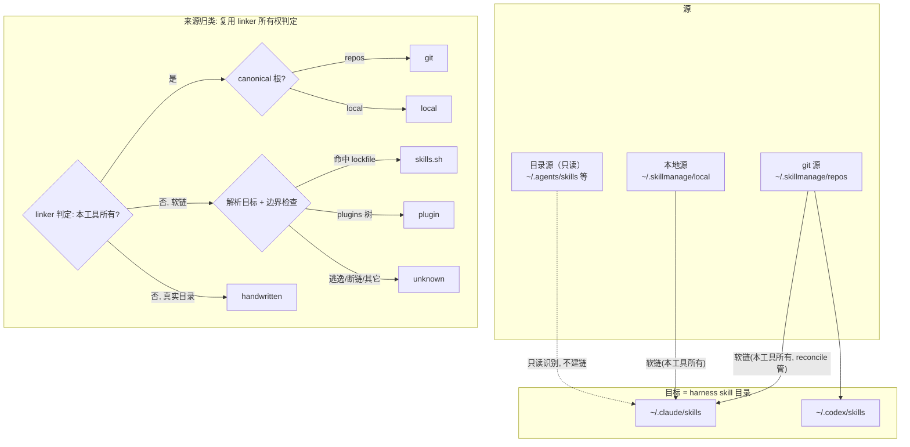

# feat: SkillManage 三期 —— 源/目标统一模型 + 目录现状视图 + 标准对齐

## 摘要

三期把 SkillManage 从「git 仓映射器」升级为 **skill 的统一控制面**：以目录为中心扫描，把每个 skill 按来源归类，并向 Agent Skills 开放标准（`.agents/` 跨工具约定）靠近，同时**绝不破坏**别家工具（skills.sh / 插件 / 手写）已装好的东西。改造集中在三层——数据模型（源类型抽象 + 目录源）、扫描与识别（标准对齐 + 来源归类 + skills.sh lockfile 读取）、前端（目录现状视图 + 启用停用/反馈）。一期/二期的 scanner/linker/reconcile/pathutil/harness 大幅复用；**不重构既有 config/manifest 数据**，新能力以向后兼容的新增字段 + 运行期派生承载。

排除：MCP / marketplace / LLM 扫描 / 主动适配其它 harness（见 origin 范围边界）。

> 本计划已经一轮多角色 doc-review 深化（2026-06-15）：修正了 npx 代调注入面、never-break 与 `looksOurs` 的矛盾、KTD2 分类在边界/大小写/copy 回退下的健壮性、Windows windowsgui 进程窗口、sourceUrl XSS，并补齐 UI 状态规格。

---

## 问题陈述

详见 origin 第一节。三类评审问题：① 选 tab 后主面板显示「来源库候选」而非「目录现状」，有歧义；② 勾选建链语义不清、无反馈，更新无结果提示；③ 目录管理未对齐业内标准、需确保与 skills.sh 等共存不破坏。更深层：业内已多工具共存（同一 `~/.claude/skills/` 下 skills.sh 链接与本工具链接并存），SkillManage 必须看得见别家、管得了自己、碰不坏共存方。

---

## 需求追溯

| 计划单元 | 覆盖 origin 需求 |
|---|---|
| U1 源类型抽象 + 目录源配置 | R1.1–R1.4 |
| U2 跨平台位置注册表 | R2.1–R2.3 |
| U3 scanner 对齐标准 + scope 判定 | R5.1–R5.3 |
| U4 never-break 第④不变式（处置 looksOurs） | R6.1 + KTD6 |
| U5 来源归类引擎 + skills.sh lockfile | R7.1, R3.2 |
| U6 目录现状视图 API（弃用 handleAdoptable） | R3.1–R3.4 |
| U7 目录源 npx 更新代调（安全加固） | R7.2–R7.3 |
| U8 现状视图前端重构 | R3.1–R3.4, SC1 |
| U9 启用停用开关 + 反馈（核心） | R4.1–R4.3, SC2 |
| U9b skills.sh 一键更新按钮 | R7.3 |

---

## 关键技术决策（KTD，含 origin Open Question 与 doc-review 发现的解）

### KTD1 · 源类型抽象的落地形态（解 OQ2，不破坏二期数据）

**决策**：源类型在**运行期派生**，不重构既有持久化结构。
- `config.Repos`（git 源）、`@local`（本地源选择子 `@local/<skill>`）**保持原样**。
- 新增**可选**字段 `Config.DirectorySources []DirectorySource`（`yaml:"directory_sources,omitempty"`），每项 `{Path, Label}`。**本期目录源恒为只读，不设 `ReadOnly` 死字段**（将来支持写入目标时再以兼容方式加字段）。旧 config.yaml 不含此字段 → 加载为空，**完全向后兼容**。
- 新增派生枚举 `SourceKind`（`git` / `local` / `directory` / `plugin` / `handwritten` / `unknown`），**不持久化**，运行期判定。
- `Manifest.LinkRecord` **不变**。

**「零迁移」的边界**：指持久化 schema 零迁移（accurate）。但 `~/.agents/skills` 被自动发现为目录源是**运行期行为增量**（仅 ScanShallow 读取、不写文件，符合第④不变式），非数据迁移——KTD3/U2 明确这一点。

### KTD2 · 来源归类判定算法（解 OQ1，已按 doc-review 硬化）

**决策**：对目标目录里 `ScanShallow` 出的每个条目，按下列**优先序**判定来源：

1. **所有权判定（无条件首关，对软链与真实目录都先做）**：复用 `linker` 既有所有权判定（见 KTD6），不另写一套。命中本工具所有权 → 看 canonical 根：在 `~/.skillmanage/repos/<repo>` 下 → `git`（记 repo）；在 `~/.skillmanage/local` 下 → `local`。**copy 回退**（Windows 跨卷拷贝、manifest 在册的真实目录）也在此关命中归 git/local，**不**落到第 3 步误判 handwritten。`target+name` 匹配在大小写不敏感文件系统（mac/Windows）上须**大小写折叠**比较，否则 `Find-Skills` vs `find-skills` 漏配、自家链接被误判 handwritten。
2. 否则若是软链，解析目标后按**显式优先序**：(a) 命中 `~/.agents/.skill-lock.json` → `skills.sh`（携带 sourceUrl）；(b) 否则在某 target 的 `PluginRootFor` 树下 → `plugin`；(c) 否则 → `unknown`。子分支顺序固定 **lockfile > plugin > unknown**（同时满足 a、b 时以 a 优先）。
3. 否则（真实目录、非软链、且第 1 关未命中所有权）→ `handwritten`（二期「未备份 / 可收编」）。

**解析与边界（安全 + 健壮）**：软链解析**复用 `linker.readLinkTarget`**（平台分文件：Unix 用 `os.Readlink`/`EvalSymlinks`，Windows junction 不可读时保守返回错误 → skills.sh 降级 unknown，符合 R-risk1）。`EvalSymlinks` 在断链/符号环时**返回错误 → 一律归 unknown，绝不 panic**。解析后的绝对路径必须做**前缀边界检查**（落在 home 子树或已登记源/目标根内）才用于分类/展示，逃逸者归 unknown 且**不读其文件**（防符号链接读任意文件）。读 `~/.agents/.skill-lock.json` 前先 `lstat` 确认是普通文件。

**理由**：所有权判定收敛到 linker 一处（KTD6），杜绝两套「是不是我们的」逻辑漂移；路径特征只给**非本工具**条目归类，不参与所有权判定。

### KTD3 · 位置注册表与跨平台（解 OQ3）

**决策**：扩展 `harness` 包，按平台 + env 解析候选默认根：
- 候选（靠 `os.UserHomeDir()` 跨平台解析 home）：`<home>/.claude/skills`、`<home>/.codex/skills`（`$CODEX_HOME` 覆盖）、`<home>/.agents/skills`。
- `DiscoverDefaultTargets()` 复用并扩展：cc/codex 仍作**默认目标**；新增 `DiscoverDefaultDirectorySources()`——探测存在则把 `~/.agents/skills` 登记为**默认目录源**（非目标），实现就是镜像 `DiscoverDefaultTargets` 的存在探测，**不引入注册表数据结构**（避免过度设计）。
- **WSL**：`os.UserHomeDir()` 天然返回 WSL 发行版 home，默认只管该 home，**不触碰** `/mnt/c`——无需特殊代码。
- **Windows skills.sh 实测**：执行 U2/U5 时实测 `%USERPROFILE%\.agents` 是否成立（残留 OQ-E1）；差异由手动登记目录源兜底，不阻塞。

### KTD4 · 现状视图与收编侧栏合并（解 OQ5）

**决策**：**合并**，且本期**弃用 `handleAdoptable`**。主面板由「来源库候选（`/api/skills?repo=`）」改为「当前 tab 目标目录现状清单（新 `/api/inventory?target=`）」。二期「未备份 skill」侧栏并入现状视图，作为 `handwritten` 来源类别就地带「收编」动作。「从库添加」降级为 `+ 添加` 抽屉（复用 `/api/skills` 列 git 源 + `@local` 未映射项）。该决策在 U6 落地，不留作执行期再议。

**理由**：评审点 1 的歧义根因正是「主面板语义=候选≠现状」；合并后语义统一为「这个目录里有什么、谁装的」，与 Agent Skills 标准 discover 模型一致。

### KTD5 · 目录源更新转交（解 OQ4，含默认提示 + 可选代调 + 安全硬约束）

**决策**：
- 默认：现状视图对 `skills.sh` 条目只读提示「由 skills.sh 管理，请用 `npx skills update` 更新」，**无启用/停用开关**。
- `exec.LookPath("npx")` 成功 → 额外渲染「一键更新」按钮 → `POST /api/dirsource/update {name}` 在 detached context + 超时（~60s）跑 `npx skills update <name>`，回传 stdout/stderr/退出码。
- 不进 reconcile/scheduler，是用户触发的一次性外部进程；由 skills.sh 自身改写其 canonical，本工具不直接写 `~/.agents`，不破坏第④不变式。

**安全硬约束（必须实现，见安全考量）**：
- `name` 必须命中**磁盘上 `~/.agents/skills/` 实际目录列表**派生的白名单（不只信 lockfile——伪造 lockfile 不能解锁无对应目录的更新目标），并过严格 skill 名正则（无前导 `-`、无路径分隔符、无 shell 元字符），否则 400。
- `exec.Command` **分离 argv**，绝不过 shell；npx 取绝对路径、不取自 CWD。
- 新状态变更端点加 **CSRF/Origin 校验**（防浏览器伪造 POST 打本地守护进程）。
- **Windows**：守护进程 `-H=windowsgui`，直接 spawn `npx.cmd` 会弹控制台窗口 → 平台分文件 runner，Windows 侧设 `SysProcAttr{HideWindow:true, CreationFlags:CREATE_NO_WINDOW}` + `cmd /c npx skills update <name>`（镜像 `linker_windows.go` 的 `cmd /c mklink`）。runner 以接口注入便于测试。

### KTD6 · 所有权判定单点化 + never-break 处置 looksOurs（解 doc-review P0）

**决策**：「是不是本工具所有」的判定**只此一处**——`linker` 包现有 `looksOurs()` / manifest 在册逻辑。KTD2 来源归类与 U4 never-break 守卫都**调用它**，不另写并行实现。

**问题**：现有 `linker.Link()` 在目标槽位有「非 manifest 在册」软链时，调 `looksOurs(tp)`——只要该软链指向 `~/.skillmanage/repos|local` 下，就 `os.Remove` 并接管。这是**路径签名所有权**，与「manifest 唯一权威」表述冲突，且使 U4「外部链接零触碰」对这条路径不成立。

**处置（U4 落地，二选一并写入注释 + 测试）**：
- (a) 固化不变式：外部工具不可能在 `~/.skillmanage/{repos,local}`（本工具私有 canonical）下产生软链，故 `looksOurs` 命中的必是自家遗留链接，接管安全；**或**
- (b) 收紧：接管也要求 manifest 在册或更强签名。

推荐 **(a)**（私有 canonical 假设成立、改动小），但必须新增测试：一个指向 `~/.skillmanage/repos` 下、不在 manifest 的软链，断言 reconcile 行为符合所选语义。

---

## 安全考量（Security Considerations）

本期新增 3 个攻击面，按可能性排序，缓解已写入相应 KTD/单元：

1. **npx 代调参数注入（P0，最可能）**：`POST /api/dirsource/update` 的 `name` 用户可控 → KTD5/U7 的磁盘白名单 + 正则 + 分离 argv + CSRF。
2. **lockfile sourceUrl 存储型 XSS（P1，影响大）**：第三方写的 `.skill-lock.json` 的 `sourceUrl` 经 `/api/inventory` 进前端 → 服务端只放行 http(s)、前端文本节点渲染、anchor href 校验后再设（U6/U8）。
3. **符号链接逃逸读任意文件（P1，最隐蔽）**：分类时 `EvalSymlinks` 结果须做前缀边界检查，逃逸归 unknown（KTD2「解析与边界」）。

**信任边界**：`~/.agents/.skill-lock.json` 是「用户拥有、第三方（skills.sh）写入」文件，**非可信**。严格 schema 解析、所有字符串字段当不可信输入；npx 更新目标的**主**白名单来自磁盘实际目录列表，lockfile 仅作二次确认。

---

## 高层设计

源 → 目标统一模型与来源归类决策流：

---

## 实现单元

> 执行姿态：改动多为既有受测模块的扩展，**测试先行**用于行为承载单元（U1–U7）；纯前端（U8/U9/U9b）以手动 + 既有 server 集成测试覆盖。安全相关（U7）与不变式相关（U4）单元须先写失败用例再实现。

### Phase A · 模型与扫描底座

### U1. 源类型抽象 + 目录源配置

- **Goal**：引入 `SourceKind` 派生枚举与 `DirectorySource` 可选配置，向后兼容二期 config。
- **Requirements**：R1.1–R1.4（KTD1）
- **Dependencies**：无
- **Files**：
  - `internal/config/config.go`（新增 `DirectorySource{Path, Label string}` + `Config.DirectorySources` omitempty；**不设 ReadOnly**）
  - `internal/source/source.go`（**新建**：`SourceKind` 常量 + 选择子判定骨架）
  - `internal/config/config_test.go`、`internal/source/source_test.go`（**新建**）
- **Approach**：不动 `Repos`/`Enabled`/`Manifest`。`SourceKind` 选择子判定按前缀（`@local`→local；`<repo>/`→git），路径类判定留给 U5。
- **Patterns to follow**：`config.RepoConfig` 的 tag 风格；`reconcile.LocalNamespace`。
- **Test scenarios**：
  - 旧 config.yaml（无 `directory_sources`）加载 → 字段为 nil，其余不变。
  - 含 `directory_sources` 往返序列化稳定。
  - `Classify("@local/x")`=local；`Classify("myrepo/x")`=git。
- **Verification**：`go test ./internal/config/... ./internal/source/...` 通过；二期 config_test 不回归。

### U2. 跨平台位置注册表

- **Goal**：按平台 + env 探测默认根；`~/.agents/skills` 探测存在则作默认目录源；cc/codex 仍作默认目标。
- **Requirements**：R2.1–R2.3（KTD3）
- **Dependencies**：U1
- **Files**：
  - `internal/harness/harness.go`（扩展 `DiscoverDefaultTargets`；新增 `DiscoverDefaultDirectorySources() []string`——简单存在探测，无注册表数据结构）
  - `internal/harness/harness_test.go`
- **Approach**：复用 `expand`/`dirExists`/`codexSkillsRoot`；`.agents/skills` 作**源**不混入目标。WSL 无特殊分支。
- **Patterns to follow**：现有 `DiscoverDefaultTargets()` 的探测-存在即登记。
- **Test scenarios**：
  - 临时 HOME 造 `.claude/skills`、`.agents/skills` → 目标含前者、目录源含后者。
  - `$CODEX_HOME` 覆盖时 codex 目标用绝对形式。
  - `.agents/skills` 不存在 → 目录源列表不含它。
- **Verification**：`go test ./internal/harness/...` 通过。

### U3. scanner 对齐 Agent Skills 标准 + scope 判定

- **Goal**：扫描遵循标准——深度上限、目录数上限、跳过 `node_modules`；新增 scope（项目/用户）判定；撞名告警。**precedence「项目级>用户级」本期仅用于现状视图展示标注（U6/U8），不在 reconcile 抑制链接**（AE3 只要求标明生效者；reconcile 抑制是新行为、风险高，推后）。
- **Requirements**：R5.1–R5.3（precedence 展示部分由 U6/U8 落地）
- **Dependencies**：无
- **Files**：
  - `internal/scanner/scanner.go`（`Scan` 增加 maxDepth≈6 / maxDirs≈2000 上限；跳过 `node_modules`）
  - `internal/harness/harness.go`（新增 `Scope(dir) → project|user`：home 前缀测试；harness 当前无此概念，需新增）
  - `internal/reconcile/reconcile.go`（撞名仍走既有 `DetectConflicts`，确保跨 scope 同名产出**告警条目**进 `Summary.Conflicts`；**不**改链接创建/抑制）
  - `internal/scanner/scanner_test.go`、`internal/harness/harness_test.go`、`internal/reconcile/reconcile_test.go`
- **Approach**：`Scan` 现已 `SkipDir` 不入 skill 子树，补 `node_modules` 跳过与深度/计数保护。`harness.Scope`（非 home 下的 `.claude/.codex/.agents` skills=project，home 下=user）供展示层判定生效者。撞名告警沿用 `DetectConflicts`，不动 `computeDesired` 决策。
- **Patterns to follow**：`reconcile.DetectConflicts`/`linker.Conflict`；`harness.isCCTarget` 的 home 前缀写法。
- **Test scenarios**：
  - 超深目录树 → 扫描在上限处停止，不卡死。
  - `node_modules/x/SKILL.md` 不被收录。
  - `harness.Scope`：home 下 `.claude/skills`=user；repo 下 `.claude/skills`=project。
  - 同名 skill 跨 project/user → 产出撞名告警条目（链接创建行为不变）。
- **Verification**：`go test ./internal/scanner/... ./internal/harness/... ./internal/reconcile/...` 通过。

### U4. never-break 第④不变式（处置 looksOurs，解 doc-review P0）

- **Goal**：把「绝不接管/覆盖/删除非本工具建立的链接与文件」收口为正式第④不变式；**显式处置 `linker.looksOurs()` 这个路径签名所有权通道**（KTD6），消除「manifest 唯一权威」与现实代码的矛盾。
- **Requirements**：R6.1 + KTD6
- **Dependencies**：无
- **Execution note**：测试先行——先写「非本工具链接在 reconcile 全程不被触碰」与「looksOurs 边界」两个失败用例，再固化语义。
- **Files**：
  - `internal/linker/linker.go`（明确 `looksOurs` 语义：按 KTD6 选 (a) 私有 canonical 不变式或 (b) 接管门控 manifest；加第④不变式注释）
  - `internal/reconcile/reconcile.go`（注释 + prune/remove 路径确认只动在册项）
  - `internal/linker/linker_test.go`、`internal/reconcile/reconcile_test.go`
- **Approach**：manifest 所有权（不变式③）已实现大部分保护，但 `looksOurs` 是第 4 通道，必须显式处理（KTD6）。本单元收口 + 显式测试。文档（README/phase2-notes 补第④条）作非阻塞收尾，不计入验收。
- **Test scenarios**：
  - 指向 `~/.agents/skills` 的外部软链（不在 manifest）→ reconcile（含 prune、remove-undesired）→ 原样存在。
  - **指向 `~/.skillmanage/repos` 下、不在 manifest 的软链 → 断言 reconcile 行为符合 KTD6 所选语义（覆盖 looksOurs 通道）。**
  - 真实手写 skill 目录 → reconcile 后原样存在。
  - 本工具自己的链接仍正常增删。
- **Verification**：`go test ./internal/linker/... ./internal/reconcile/...` 通过；含 looksOurs 边界用例。

### Phase B · 识别与互通（后端）

### U5. 来源归类引擎 + skills.sh lockfile 读取

- **Goal**：实现 KTD2 归类算法（所有权判定**复用 linker**，KTD6）；解析 `~/.agents/.skill-lock.json`（v3）。
- **Requirements**：R7.1, R3.2, KTD6
- **Dependencies**：U1, U2, U4（U4 固化 linker 所有权语义后复用之）
- **位置决策**：默认 `internal/source` 独立包；分类的**所有权那一步必须调用 linker 判定，不重写**，并加「分类所有权结论 == linker 结论」交叉测试，防漂移。
- **Files**：
  - `internal/source/classify.go`（**新建**：`ClassifyInTarget(entry, mgr *linker.Manager, lock, pluginRoots) → (SourceKind, label)`——传入 `linker.Manager` 复用其 reposRoot/personalStore/所有权判定，缩小参数面）
  - `internal/source/skilllock.go`（**新建**：读 `.skill-lock.json` v3：`skills[name].{source,sourceUrl,skillFolderHash}`；缺文件=空；**严格 schema、字段当不可信**；读前 lstat 确认非软链）
  - `internal/source/classify_test.go`、`internal/source/skilllock_test.go`
- **Approach**：纯函数 + 注入式输入，无副作用。软链解析**复用 `linker.readLinkTarget`**；`EvalSymlinks` 错误 → unknown；解析后路径前缀边界检查（KTD2）；manifest `target+name` 匹配大小写折叠。
- **Patterns to follow**：`config.LoadCredentials` 缺文件→空；`linker.looksOurs`/`readLinkTarget`；`adopt` 的快照传参。
- **Test scenarios**：
  - manifest 在册 + 在 repos → git；在 local → local；**manifest 在册的 copy 真实目录 → git/local（非 handwritten）**。
  - 软链指向 `~/.agents/skills/find-skills` 且 lockfile 含该条 → skills.sh + sourceUrl。
  - 软链指向 plugins 树 → plugin；同时满足 lockfile+plugin → 按 lockfile 优先。
  - 真实目录（manifest 未命中）→ handwritten。
  - lockfile 缺失 / 断链 / 符号环 → unknown（不报错、不 panic）。
  - **大小写不敏感：`Find-Skills` 目录 + manifest 记 `find-skills` → 命中所有权，不误判 handwritten。**
  - **符号链接逃逸：指向 `/etc/passwd` → unknown，且不读取其文件。**
  - 分类所有权结论 == linker 结论（交叉测试）。
- **Verification**：`go test ./internal/source/...` 通过，覆盖 6 类 + 全部边界。

### U6. 目录现状视图 API（弃用 handleAdoptable）

- **Goal**：新增 `/api/inventory?target=<dir>`，返回目标目录现状清单，每条带来源归类与状态。**`handleAdoptable` 就此弃用并由本端点取代**（KTD4 落地，handwritten 类内含「收编」）。
- **Requirements**：R3.1–R3.4（KTD4）
- **Dependencies**：U5
- **Files**：
  - `internal/server/api.go`（新增 `handleInventory` + 路由；**移除 `handleAdoptable` 路由**，前端 `fetchAdoptable` 在 U8 废弃）
  - `internal/server/server.go`（**新增 Server 字段**：缓存各 target 的 pluginRoots（启动时 `harness.PluginRootFor` 枚举）与解析后的 `.skill-lock.json`；本单元明确交付，非「如需」）
  - `internal/server/server_test.go`
- **Approach**：对 `?target=` 解析后 `ScanShallow`，逐条 `source.ClassifyInTarget`，组装 `InventoryItem{Name, Description, SourceKind, SourceLabel, SourceURL, Scope, Managed, Enabled, LinkType, Collision}`。`Enabled` 由 `cfg.Enabled` 比对；`Scope` 由 `harness.Scope` 判定。**`SourceURL` 服务端先校验是 http(s) 才放行**，否则置空（防 XSS）。**并发一致性**：inventory 读 manifest 须与 reconcile 同锁（或取 RWMutex 快照）；分类是时点值，收编/启用动作执行前在锁内复核所有权（防 TOCTOU）。
- **Patterns to follow**：`handleAdoptable` 的 target 作用域过滤 + manifest 快照（`s.mu`）；`handleListSkills` 的 JSON 风格。
- **Test scenarios**：
  - 目标目录含「git 链接 + local 链接 + 外部 skills.sh 链接 + 真实手写目录」→ 四类都出现且归类正确，外部条目 `Managed=false`。
  - lockfile `sourceUrl` 为 `javascript:...` → 响应 `SourceURL` 被置空/拒绝。
  - `?target=` 非配置目录 → 400；空目录 → 空清单（非 null）。
- **Verification**：`go test ./internal/server/...` 通过；多来源 + sourceUrl 过滤用例通过。

### U7. 目录源 npx 更新代调（安全加固）

- **Goal**：探测 `npx`；提供 `POST /api/dirsource/update {name}` 安全代调 `npx skills update <name>`。
- **Requirements**：R7.2–R7.3（KTD5 安全硬约束）
- **Dependencies**：U5
- **Execution note**：先写注入失败用例（恶意 name 被拒）再实现。
- **Files**：
  - `internal/server/api.go`（`handleDirSourceUpdate`：**name 白名单**（命中磁盘 `~/.agents/skills/` 实际目录 + 严格正则）+ **CSRF/Origin 校验**；status 带 `npxAvailable bool`）
  - `internal/server/runner_unix.go` / `internal/server/runner_windows.go`（**新建，平台分文件**：Windows 设 `SysProcAttr{HideWindow,CreationFlags:CREATE_NO_WINDOW}` + `cmd /c`；npx 绝对路径不取 CWD）
  - `internal/server/server.go`（`exec.LookPath("npx")` 探测缓存）
  - `internal/server/server_test.go`
- **Approach**：detached context + 超时（~60s）；exec.Command 分离 argv，绝不过 shell。npx 不在场 → `npxAvailable=false`、端点 412、前端不渲染按钮。runner 接口注入便于测试。
- **Patterns to follow**：`handleUpdateNow` 的 `s.detachedCtx()`；`linker_windows.go` 的 `cmd /c` + 平台分文件；`gitsync.run` 的超时/env。
- **Test scenarios**：
  - **name=`--version` / `; rm` / 带分隔符 → 400（不执行）。**
  - **name 不在磁盘 `~/.agents/skills/` 列表 → 400。**
  - 缺 Origin/CSRF 头的跨站 POST → 拒绝。
  - `npxAvailable=false` → status 不报 npx，端点拒绝并清晰报错。
  - （注入 runner）成功 → 回传退出码/输出；超时 → 明确超时错误，不挂起。
- **Verification**：`go test ./internal/server/...` 通过，含注入/CSRF 用例。

### Phase C · 前端

### U8. 现状视图前端重构

- **Goal**：主面板改为按当前 tab 调 `/api/inventory` 渲染现状清单，每条标来源；「从库添加」降级为 `+ 添加` 抽屉；收编动作就地。
- **Requirements**：R3.1–R3.4, SC1
- **Dependencies**：U6
- **Files**：
  - `internal/server/dist/app.js`（现状视图渲染、来源徽章、`+ 添加`抽屉、收编内联；**废弃 `fetchAdoptable`**）
  - `internal/server/dist/index.html`（主面板结构调整；移除 `未备份 skill` 侧栏，并入现状视图）
  - `internal/server/dist/app.css`（来源徽章样式 6 类）
- **UI 状态规格（本单元必须实现，解 design 审查）**：
  - **来源徽章**（label + 视觉）：`git`→「git · <repo>」；`local`→「本地」；`skills.sh`→「skills.sh · <sourceUrl 域名>」（hover 显示完整 url，**文本渲染**不用 innerHTML）；`plugin`→「插件」；`handwritten`→「未备份」；`unknown`→「未知软链」。颜色非唯一区分（带文字/图标，无障碍基线）。
  - **每类可用动作**：git/local → 启用/停用开关（U9）；skills.sh → 只读 + 更新提示/一键按钮（U9b）；handwritten → 「收编」；plugin/unknown → 只读无动作。
  - **收编流程**：handwritten 行点「收编」→ 确认弹窗「将 <name> 移入 ~/.skillmanage/local 并建软链？会移动原目录」→ 调既有 adopt API → 成功后徽章 handwritten→local、出现启用开关 → 失败行内报错。
  - **撞名展示（AE3）**：`Collision=true` 被遮蔽行显示「遮蔽」警示 + tooltip「被 <scope> 同名 skill 遮蔽，实际不生效」；生效行可标「生效」。
  - **`+ 添加`抽屉**：按钮置主面板工具条；点开为侧 panel/modal，列「本 tab 尚未启用」的 git 源 + `@local` 项，带搜索；点行内「启用」→ 反馈 toast → 抽屉保持打开、现状列表刷新。
  - **`全选并跟随`去留**：整仓跟随移入 `+ 添加`抽屉，作「启用整仓 / 跟随」动作（不在主面板）。
  - **空目录态**：「该目录暂无 skill。点 + 添加 从库选取，或在目录创建 SKILL.md 后刷新。」
  - **加载/错误态**：fetch 在途显骨架/「正在扫描…」；失败显行内错误 + 重试；切 tab 时旧内容保留至新数据到达。
- **Patterns to follow**：二期 `renderRepos`/tab 切换；既有 modal 做抽屉。
- **Test scenarios**：`Test expectation: 手动验证 + U6 后端用例覆盖数据正确性`。
- **Verification**：手动核对 AE1（多来源共存、外部条目无启用开关、零误删）+ AE3（撞名展示）+ 空/加载/错误态。

### U9. 启用/停用开关 + 操作反馈 + 更新结果提示（核心，不依赖 npx）

- **Goal**：勾选→启用/停用开关；建/拆链即时反馈；立即更新报「N 个源有更新 / 已是最新」。
- **Requirements**：R4.1–R4.3, SC2
- **Dependencies**：U6, U8（**不**依赖 U7——核心反馈不应被 npx 阻塞）
- **UI 状态规格**：
  - 开关控件用**带标签的 switch 或显式 启用/停用 按钮**（避开二期被诟病的 checkbox 歧义）。
  - **在途态**：点击后开关禁用 + spinner，等 reconcile 返回。
  - **失败回滚**：失败则开关回原态 + 行内错误。
  - 行视觉区分已启用（软链在）/已停用（无链）。
- **Files**：
  - `internal/server/dist/app.js`（开关交互、toast/inline 反馈、解析 Summary 报数）
  - `internal/server/dist/app.css`（开关/toast 样式）
  - `internal/server/api.go`（按 OQ-E3：`/api/enabled` 增删响应直接回传本次 reconcile `Summary` 驱动反馈）
- **Approach**：复用 `reconcile.Summary`（Created/Removed）驱动「已建立/已移除软链 X」与「N 个源有更新/已是最新」；停用走既有 `DELETE /api/enabled` + `ReconcileOnly`。
- **Patterns to follow**：二期 `confirmModal`、`/api/update-now` 返回 Summary 链路。
- **Test scenarios**：`Test expectation: 手动验证`；Summary 报数由既有 reconcile_test 覆盖。
- **Verification**：手动核对 AE2（停用即时拆链 + 反馈）、更新结果文案随 Summary 变化。

### U9b. skills.sh 一键更新按钮（依赖 npx）

- **Goal**：skills.sh 条目在 npx 可用时显示「一键更新」，调 U7 端点。
- **Requirements**：R7.3
- **Dependencies**：U7, U8
- **UI 状态规格**：点击→按钮禁用+「更新中…」；成功→toast「已更新 <name>」或 stdout 前几行；失败→行内 stderr 摘要+退出码；超时→「更新超时(60s)，请手动运行 npx skills update <name>」。
- **Files**：`internal/server/dist/app.js`、`internal/server/dist/app.css`
- **Approach**：据 status 的 `npxAvailable` 决定是否渲染按钮；调 `POST /api/dirsource/update`。
- **Test scenarios**：`Test expectation: 手动验证（npx 在场/不在场两态）`。
- **Verification**：手动核对 AE4（无 npx 时只提示无按钮）。

---

## 范围边界

### Deferred for later（沿用 origin）
- MCP server 集中管理 / marketplace / LLM 安全扫描 / 主动适配其它 harness（Cursor/Gemini 可作目录源被动登记）。

### Outside this product's identity（沿用 origin）
- 不做安装器（不取代 skills.sh/插件市场的获取职责）；不接管别家 canonical（除用户显式触发、由别家原生工具执行的代调）。

### Deferred to Follow-Up Work（本计划实现期外）
- 现状视图的搜索/筛选按来源类别过滤（增量 UX，本期先出基础视图）。
- `~/.agents/skills` 作为**写入目标**的可选开关（origin 已定本期不写；届时再加 `DirectorySource.ReadOnly` 字段，本期不设死字段）。
- 在 **reconcile 层**按「项目级>用户级」**抑制**用户级链接（本期仅在现状视图展示遮蔽，不改链接创建行为）。
- U4 第④不变式的 README/phase2-notes 文档补写（非阻塞收尾）。

---

## 风险与依赖

- **D1**：复用 scanner/linker/reconcile/pathutil/harness/adopt；三期新增 `internal/source` 包 + 两个 API 端点 + 平台分文件 runner + 前端重构。
- **R-risk1**：`.skill-lock.json` 格式或 `~/.agents` 位置随 skills.sh 演进而变 → 归类引擎对缺文件/未知格式**降级 unknown 不报错**（U5），手动登记目录源兜底。
- **R-risk2**：现状视图重构触及主面板核心交互，回归面大 → U6 后端用例先锁数据正确性，前端只做呈现。
- **R-risk3**：npx 代调引入外部进程 → 严格白名单 + 超时 + 注入式 runner + npx 不在场即隐藏 + CSRF，限制爆炸半径（见安全考量）。
- **R-risk4**：inventory 与后台 reconcile 并发读写同一目录存在 TOCTOU → U6 规定 inventory 读 manifest 同锁、收编/启用执行前锁内复核。

---

## 残留 Open Question（执行期解决）

- **OQ-E1**：实测 Windows / WSL 下 skills.sh 的 canonical 与 lockfile 实际位置（KTD3 假设 `%USERPROFILE%\.agents`）。执行 U2/U5 时在目标平台验证；差异由手动登记兜底，不阻塞。
- **OQ-E3**：已定——`/api/enabled` 增删直接回传本次 reconcile 的 `Summary` 驱动 U9 反馈（见 U9 Files），不再前端二次拉 status。

---

## Sources & Research

- origin：`docs/brainstorms/2026-06-15-skillmanage-phase3-requirements.md`
- 业内：Agent Skills 规范（agentskills.io，客户端实现指南）；`.agents/skills` 跨工具约定（AAIF）；skills.sh = vercel-labs/skills（`npx skills`，canonical `~/.agents/skills`，lockfile `~/.agents/.skill-lock.json` v3）。
- 本机实测：`~/.claude/skills/` 下 skills.sh 链接（`find-skills → ~/.agents/skills/find-skills`）与 SkillManage 链接（`→ ~/.skillmanage/local/*`）干净共存；lockfile v3 字段 `source/sourceUrl/skillFolderHash/installedAt/updatedAt` 已确认。
- doc-review（2026-06-15，6 角色）：修正 npx 注入面、never-break×looksOurs 矛盾、KTD2 边界/大小写/copy 健壮性、Windows windowsgui 进程窗口、sourceUrl XSS、UI 状态规格缺失。
